<div class="cover">

<div class="eyebrow">Canonical · v2 · for team and AI reference</div>

# The Method

<div class="subtitle">An agentic refinement method. Event storming, domain-driven design, and refinement — made cheap. One loop. Many depths.</div>

<div class="meta">

<strong>Status</strong> Canonical — current locked design<br>
<strong>Scope</strong> Spec generation — from fuzzy intent to DoR-ready stories with tests, decisions, and compliance evidence. Implementation happens in your own coding tool, against the specs the Method produces.<br>
<strong>Date</strong> June 2026<br>
<strong>Audience</strong> Engineering teams using the Method, and the AI agents being built against it

</div>

</div>

<div class="toc">

<div class="toc-label">Contents</div>

<ol>
<li><a href="#what-this-document-is">What this document is</a></li>
<li><a href="#thesis">Thesis</a></li>
<li><a href="#the-unified-loop">The unified loop</a></li>
<li><a href="#the-three-modes">The three modes — doing, drafting, interviewing</a></li>
<li><a href="#the-role-panel">The role panel</a></li>
<li><a href="#triage-and-routing">Triage and routing</a></li>
<li><a href="#domain-discovery">Domain discovery — event storming and ubiquitous language</a></li>
<li><a href="#recursive-decomposition">Recursive decomposition</a></li>
<li><a href="#skills-as-internal-capabilities">Skills as internal capabilities</a></li>
<li><a href="#definition-of-ready">Definition of Ready — the gate</a></li>
<li><a href="#stop-conditions">Stop conditions</a></li>
<li><a href="#adrs-and-the-promotion-rule">ADRs and the promotion rule</a></li>
<li><a href="#testing-strategy">Testing strategy</a></li>
<li><a href="#compliance-baked-in">Compliance baked in</a></li>
<li><a href="#team-pattern">Team pattern — convene, drive, disperse</a></li>
<li><a href="#memory-via-gbrain">Memory via gbrain</a></li>
<li><a href="#configuration">Configuration (method.config.yaml)</a></li>
<li><a href="#the-three-tier-context-model">The three-tier context model</a></li>
<li><a href="#failure-modes-and-mitigations">Failure modes and mitigations</a></li>
<li><a href="#storage-and-artifacts">Storage and artifacts</a></li>
<li><a href="#distribution-and-versioning">Distribution and versioning</a></li>
<li><a href="#whats-out-of-scope">What's out of scope</a></li>
<li><a href="#open-questions">Open questions</a></li>
<li><a href="#glossary">Glossary</a></li>
</ol>

</div>

## What this document is

The canonical specification of the Method. It serves two audiences:

- **Humans on the engineering team** read this to understand what the Method is, how the system works, and how their day-to-day changes when it's in use.
- **AI agents building or running the Method** read this as the authoritative spec. Where this document is precise, treat it as binding. Where it's open, defer to a human decision.

Sections 1–7 set the framing and the architecture. Sections 8–13 cover mechanics (skills, DoR, stop conditions, ADRs, testing, compliance). Sections 14–17 cover team pattern, memory, failure modes, storage. Sections 18–20 are scope, open questions, glossary.

## Thesis

Code got cheap. Spec quality is the new bottleneck. Everyone building seriously has noticed.

The thinking traditions already had the answer. **Event storming** maps a domain until its real boundaries show. **Domain-driven design** keeps the model in the code honest to the model in the conversation. **Refinement** turns fog into stories a developer can pick up. All correct. All chronically skipped — because they needed a skilled facilitator, time the team had already promised elsewhere, and produced artifacts that were lost the week after.

AI fixes the economics. A patient, expert facilitator is available on demand; the conversation *becomes* the artifact; the artifact persists and turns into work. What was a two-day workshop is a forty-minute session.

<div class="callout">
<div class="callout-label">The partnership</div>
<p>The AI is not taking dictation, and you are not rubber-stamping its output. It <em>brings</em> expertise — patterns from a thousand systems, the option you didn't reach for. It <em>surfaces</em> gaps — the unasked question, the edge case. And it <em>pushes back</em> — that contradicts your audit-log decision; you're assuming single-tenant; this story is doing two things.</p>
<p>You bring taste, domain knowledge, and the final call. You stay the author. The Method makes you a sharper one.</p>
</div>

**This is not vibe coding.** That camp ships by feel and finds out at runtime — fine for prototypes, fatal for software that has to stand up. The Method is for production B2B, regulated environments, systems with a real audit and a real blast radius. For that work, the hour saved skipping refinement is the quarter spent in remediation.

The human contributes judgment. The Method interrogates it, structures it, remembers it, and turns it into work the team can ship.

<div class="callout">
<div class="callout-label">Isn't this waterfall?</div>
<p>Waterfall failed because upstream thinking was <em>slow</em> — months of analysis, stale before the first commit. The Agile correction was never "stop thinking", it was "think small, ship small, learn." That only works when the thinking is cheap. Now it is.</p>
<p>Stories stay ≤3 points. Discovery is continuous, not a phase. One developer runs every role through the AI — no handoff chain. This is waterfall's rigour made affordable, not waterfall's calendar revived.</p>
</div>

## The unified loop

The method runs as **one loop**, invoked by a developer describing what they want in plain language. The loop handles inputs of any size — a single bug, a decision, a feature, a multi-epic rebuild — by adapting its **depth** of recursion. The loop **shape** itself is invariant.

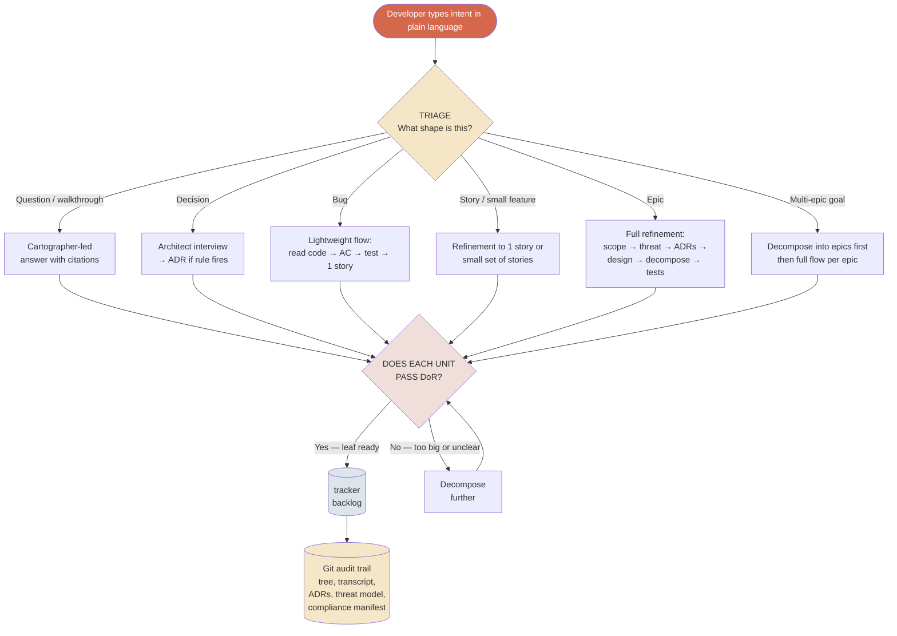

<div class="diagram-caption">The unified loop — same shape, depth adapts to the input</div>

### The "same loop, many depths" principle

| Input | Depth of recursion | Output |
|---|---|---|
| *"Should we use UUIDv7 over UUIDv4?"* | 1 turn — triage → decision | ADR or informal decision. No tracker. |
| *"How does the legacy wallet linkage work?"* | 1 turn — triage → walkthrough | Cited findings. No tracker. |
| *"Fix the Solana wallet linkage bug"* | Triage → 1 story | 1 tracker story with failing test |
| *"Add bulk asset export feature"* | Triage → 1 epic → ~10–20 stories | 1 tracker epic + stories + ADRs + threat model |
| *"Clean-slate the platform rebuild"* | Triage → ~8 epics → ~100+ stories | Many tracker epics, each fully refined |

The depth varies enormously. The loop itself is identical. That's what makes the method predictable: developers learn one mental model and it works at every scale.

### Three layers, decoupled

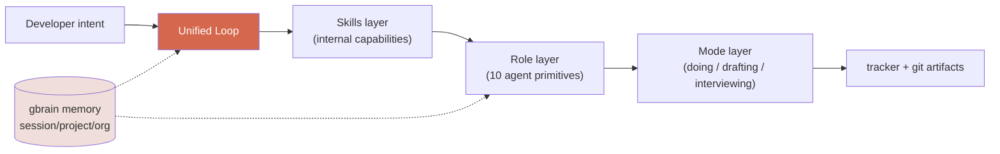

<div class="diagram-caption">Layers — the developer interacts with the loop; everything else is internal</div>

## The three modes

Every agent output operates in exactly one of three modes. The mode is explicit on every output, captured in the audit trail.

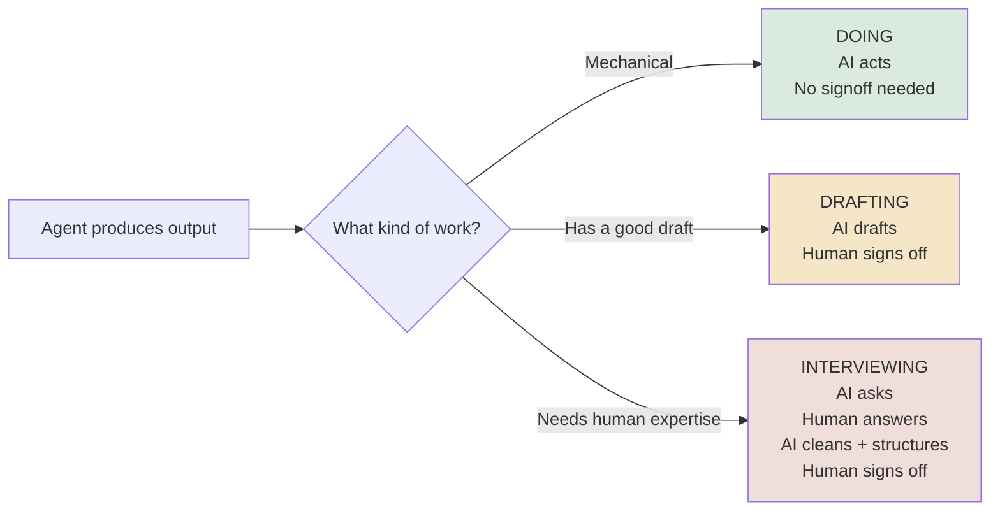

<div class="diagram-caption">The three modes of every agent output</div>

| Mode | Pattern | Best for |
|---|---|---|
| **Doing** | AI acts, no human signoff | Mechanical work — reading code, running tests, generating tags |
| **Drafting** | AI drafts → human signs off | Structured outputs where AI has a strong first draft (code, tests, decompositions) |
| **Interviewing** | AI asks → human answers → AI cleans, structures, augments → human signs off | Knowledge-dependent outputs where the human's expertise is the value |

### Why interviewing matters

The naive pattern — AI drafts, human reviews — has a known failure mode: humans rubber-stamp. The interview pattern flips it: the AI asks targeted questions, the human answers from their own knowledge, the AI structures and cleans the answers (typos fixed, half-finished thoughts completed, organisation imposed) and adds what the human missed. The human signs off on the cleaned artifact.

The **signed-off cleaned artifact is the compliance evidence**, not the raw chat. The raw chat log lives in `plans/{epic}/conversation.md` alongside the artifact, available if anyone needs to verify "yes, this conversation actually happened."

This is what separates the method from "skills that have good prompts" — the human's *thinking* is the input, structured by the AI, approved by the human.

### The doing / deciding split (the operating principle)

<div class="callout">
<div class="callout-label">Operating principle</div>
<p>The AI does. The human decides — or signs off.</p>
</div>

- **AI does, autonomously:** reading code, drafting summaries, generating subnodes, writing test code from AC, writing implementation from failing tests, running scans, mapping controls, drafting ADRs, drafting threat models, generating compliance evidence.
- **Human decides** (or signs off): scope, acceptance criteria, trade-offs at architectural branch points, whether an ADR draft is correct, whether a leaf is "ready", whether the threat model is genuine, what to do with critic findings.
- **The middle — AI proposes, human signs off:** story-point estimates, decomposition shape, stop conditions, test coverage adequacy.

Every output is tagged `decision_required: true | false`. The audit trail records every human sign-off — that's the evidence trail.

## The role panel

Ten roles. Each has a distinct context window, output shape, quality bar, invocation trigger, failure mode, and primary mode. A role exists when those six things make it irreducible to another role.

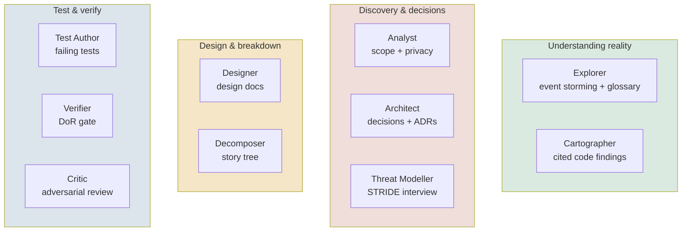

<div class="diagram-caption">The role panel — grouped by where they fire. The Explorer maps the domain; the Cartographer reads the code; the rest turn that understanding into a ready spec.</div>

Detailed role cards follow. Each describes the role's job, context, output, quality bar, triggers, and failure mode.

<div class="role-card">

### Explorer
<div class="role-tags">Mode: interviewing · Triggered by: /storm, front of an epic in unfamiliar domain</div>

<dl>
<dt>Job</dt><dd>Facilitates event storming as a conversation. Maps domain events, commands, actors, policies, read models, and hotspots; proposes bounded contexts; owns the ubiquitous-language glossary. Where the Cartographer reads what's <em>built</em>, the Explorer maps what's <em>true</em> about the domain.</dd>
<dt>Context</dt><dd>The intent, the domain glossary, past domain maps from gbrain, Cartographer findings if existing code encodes part of the domain.</dd>
<dt>Output</dt><dd><code>plans/{epic}/domain-map.md</code> (events, policies, hotspots, proposed bounded contexts) + updates to <code>docs/domain-glossary.md</code>.</dd>
<dt>Quality bar</dt><dd>Map in the language of the domain, not technical jargon. Hotspots named, not smoothed. A better model than the human's first pass — evidence the Explorer brought, surfaced, and pushed back. No unresolved language drift.</dd>
<dt>Triggers</dt><dd>Front of an epic in unfamiliar or contested territory; greenfield; rebuilds; a team that doesn't yet share a model.</dd>
<dt>Failure mode</dt><dd>Stenography — transcribing the human's first-pass model. Smoothing hotspots. Letting language drift. Modelling a seamed domain as one blob.</dd>
</dl>
</div>

<div class="role-card">

### Cartographer
<div class="role-tags">Mode: doing · Triggered by: existing-code-read</div>

<dl>
<dt>Job</dt><dd>Reads the existing system. Maps behaviours, data, integrations. Read-only on old code.</dd>
<dt>Context</dt><dd>The codebase, plus the question being asked. Does not see ADRs unless given explicitly.</dd>
<dt>Output</dt><dd>Structured findings with mandatory <code>file:line</code> citations. System maps, behaviour catalogues, data model extracts.</dd>
<dt>Quality bar</dt><dd>Every claim is verifiable. No assertion without a citation.</dd>
<dt>Triggers</dt><dd>Conversation references existing system behaviour; human can't answer "does the system do X today?"; any rebuild work or refactoring.</dd>
<dt>Failure mode</dt><dd>Mis-reads code; cites wrong file; hallucinates behaviour that doesn't exist.</dd>
</dl>
</div>

<div class="role-card">

### Analyst
<div class="role-tags">Modes: interviewing (scope), drafting (privacy lens)</div>

<dl>
<dt>Job</dt><dd><strong>Scope mode</strong>: interviews the human to establish what is being built, for whom, why, what's in/out. <strong>Privacy lens mode</strong>: assesses data-handling implications per the project's data-handling ADR.</dd>
<dt>Context</dt><dd>The goal, relevant past plans from gbrain, the project's domain context.</dd>
<dt>Output</dt><dd>Scope mode: cleaned brief, signed off by human. Privacy mode: classification assessment.</dd>
<dt>Quality bar</dt><dd>Scope explicit including out-of-scope. Privacy assessments cite the project's data classes precisely.</dd>
<dt>Triggers</dt><dd>Epic kickoff (scope mode); any node touching Confidential or Restricted data (privacy mode).</dd>
<dt>Failure mode</dt><dd>Accepts unclear scope; misses privacy implications when data flows are indirect.</dd>
</dl>
</div>

<div class="role-card">

### Architect
<div class="role-tags">Modes: interviewing (decisions), drafting (ADR doc)</div>

<dl>
<dt>Job</dt><dd>Surfaces and resolves architectural decisions. Interviews the human on trade-offs. Drafts ADRs from interview output. Surfaces risks alongside trade-offs.</dd>
<dt>Context</dt><dd>The question, relevant existing ADRs from gbrain, Cartographer findings if existing code is involved.</dd>
<dt>Output</dt><dd>Cleaned interview synthesis + draft ADR (when promotion rule fires) + risk register entries.</dd>
<dt>Quality bar</dt><dd>≥2 genuine alternatives surfaced when a decision is durable. Trade-offs explicit. Every existing-ADR reference cites the ADR by ID.</dd>
<dt>Triggers</dt><dd>Decision points surfaced during refinement; conflicts with existing ADRs detected.</dd>
<dt>Failure mode</dt><dd>Hallucinates "alternatives considered" that aren't real; cites ADRs that don't exist.</dd>
</dl>
</div>

<div class="role-card">

### Designer
<div class="role-tags">Mode: drafting</div>

<dl>
<dt>Job</dt><dd>Translates brief + ADRs + Cartographer's map into design docs (data model, API contracts, UI components, equivalence/divergence spec).</dd>
<dt>Context</dt><dd>Brief, accepted ADRs, existing-system map, design template.</dd>
<dt>Output</dt><dd><code>plans/{epic}/design.md</code> per the project's design template.</dd>
<dt>Quality bar</dt><dd>Precise enough that Decomposer can produce DoR-ready leaves from it.</dd>
<dt>Triggers</dt><dd>After ADRs are accepted; before Decomposer runs.</dd>
<dt>Failure mode</dt><dd>Under-specifies contracts; misses error cases; ignores accepted ADRs.</dd>
</dl>
</div>

<div class="role-card">

### Decomposer
<div class="role-tags">Mode: drafting</div>

<dl>
<dt>Job</dt><dd>Breaks design into story tree. Estimates story points. Recursively splits anything &gt;3 points until every leaf fits.</dd>
<dt>Context</dt><dd>Design doc, relevant ADRs, past similar stories from gbrain.</dd>
<dt>Output</dt><dd>Tree of stories, each carrying point estimate + AC + linked ADR.</dd>
<dt>Quality bar</dt><dd>Every leaf is ≤3 points. Every leaf has testable AC. Every leaf carries one of {linked ADR, "no architectural impact" tag}.</dd>
<dt>Triggers</dt><dd>Design doc approved; epic kickoff for a tightly-scoped epic.</dd>
<dt>Failure mode</dt><dd>Estimates poorly; misses dependencies; trees that look complete but skip an obvious story.</dd>
</dl>
</div>

<div class="role-card">

### Test Author
<div class="role-tags">Mode: drafting · Runs during refinement, not after</div>

<dl>
<dt>Job</dt><dd>Writes failing test from AC. A story is only DoR-ready when its test compiles and fails for the right reason.</dd>
<dt>Context</dt><dd>Story + AC + design + relevant ADRs + interface stubs. <strong>Does not see implementation.</strong></dd>
<dt>Output</dt><dd>Test file with a test that compiles and fails on assertion.</dd>
<dt>Quality bar</dt><dd>Test fails for the right reason. Test exercises behaviour, not just coverage.</dd>
<dt>Triggers</dt><dd>Story has AC and is approaching DoR.</dd>
<dt>Failure mode</dt><dd>Vacuous tests; over-mocking; tests that compile but don't actually fail when code is wrong.</dd>
</dl>
</div>

<div class="role-card">

### Verifier
<div class="role-tags">Mode: doing — DoR gate</div>

<dl>
<dt>Job</dt><dd>Confirms a leaf passes the eight Definition-of-Ready criteria, including that a failing test exists and fails for the right reason. The gate a story passes before exiting refinement.</dd>
<dt>Context</dt><dd>The leaf + the DoR checklist + the test file to run.</dd>
<dt>Output</dt><dd>Pass/fail report with specific blockers.</dd>
<dt>Quality bar</dt><dd>No false positives on "ready". A leaf marked ready genuinely meets every DoR criterion.</dd>
<dt>Triggers</dt><dd>A leaf reaching candidate-ready state.</dd>
<dt>Failure mode</dt><dd>Passes leaves that don't actually meet DoR; treats the failing-test check as optional.</dd>
</dl>
</div>

<div class="role-card">

### Critic
<div class="role-tags">Mode: doing — test critique (auto) + on-demand review</div>

<dl>
<dt>Job</dt><dd>Adversarial review. <strong>Test critique</strong> after Test Author: does this test exercise the right behaviour, or just hit coverage? <strong>On-demand critique</strong> via <code>/review</code>: refutes a PR, code file, or design doc the human points it at.</dd>
<dt>Context</dt><dd>Test critique: <code>(story, AC, design, test file)</code>. On-demand: the review target + any supplied spec + ADRs + the structured reference layer.</dd>
<dt>Output</dt><dd>Structured findings with severity and rationale.</dd>
<dt>Quality bar</dt><dd>Findings are concrete and actionable. Adversarial <em>by default</em>; defaults to "refuted" when uncertain.</dd>
<dt>Triggers</dt><dd>Test file produced (test critique); <code>/review</code> invoked (on-demand).</dd>
<dt>Failure mode</dt><dd>Going along with the test/work; consensus illusion with other agents.</dd>
</dl>
</div>

<div class="role-card">

### Threat Modeller
<div class="role-tags">Mode: interviewing · engagement IS the evidence</div>

<dl>
<dt>Job</dt><dd>Drives a STRIDE-style threat modelling interview at epic kickoff. Captures engineer responses in chat, cleans + structures them for the artifact, augments with gaps the engineer didn't surface, surfaces signed-off model.</dd>
<dt>Context</dt><dd>Epic brief, past threat models from gbrain, the project's threat landscape.</dd>
<dt>Output</dt><dd>Cleaned + signed structured threat model + reference to raw chat transcript.</dd>
<dt>Quality bar</dt><dd>Human engagement evidenced (not generated). Gaps flagged as AI-surfaced. Project-specific threats (for multi-tenant B2B SaaS: cross-tenant, insider, repudiation, audit chain) actively surfaced.</dd>
<dt>Triggers</dt><dd>Epic kickoff (mandatory); any story introducing new attack surface, changing auth boundaries, or modifying audit chain integrity.</dd>
<dt>Failure mode</dt><dd>Generic STRIDE output that does not engage the engineer's domain knowledge — produces theatre, not evidence.</dd>
</dl>
</div>

## Triage and routing

The first step of the unified loop. The developer types intent in plain language; the method determines the shape of the work before anything else happens.

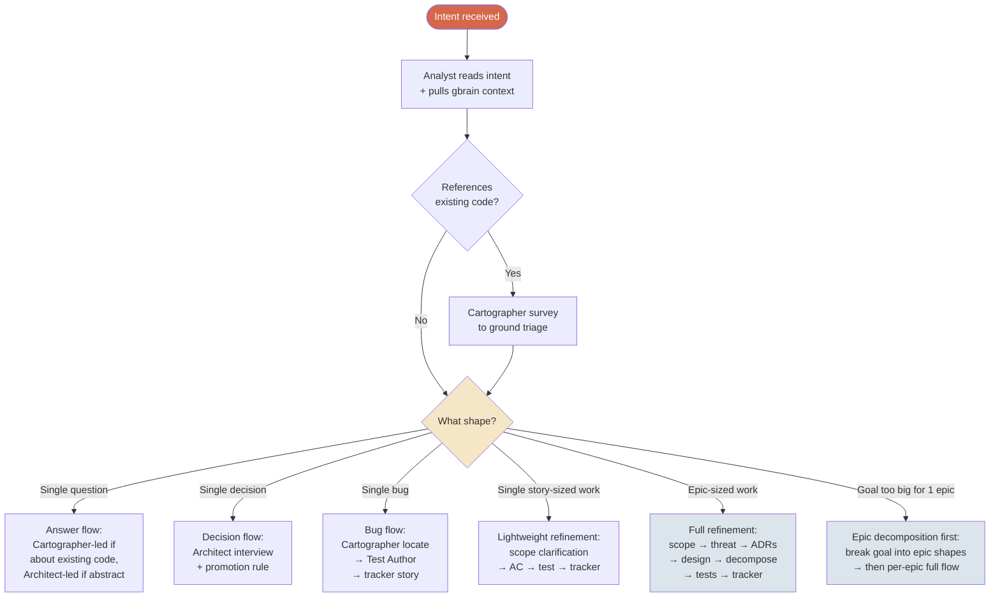

<div class="diagram-caption">Triage — how the method decides what depth to run at</div>

### What the triage analyst considers

- **Verbs and nouns in the intent.** "fix" → likely a bug. "add", "implement", "build" → likely a story or epic. "should", "evaluate", "decide" → decision. "how does" → walkthrough. "rebuild", "redesign at scale" → multi-epic.
- **Scope words.** "the platform", "the new build", "from scratch" suggest multi-epic. "the bulk export endpoint" suggests a single epic. "the wallet linkage bug" suggests a single story.
- **Implications surfaced by Cartographer.** If a quick survey reveals the intent touches many modules, that biases toward bigger sizing.
- **Past plans from gbrain.** If a similar intent has come up before and produced an epic, this one probably will too.
- **Compliance triggers.** If the intent touches Confidential/Restricted data, auth boundaries, or audit chain, the triage step pre-loads the Threat Modeller and Privacy Lens requirements.

The triage step is **always interview-led**. If the AI is uncertain about the shape, it asks the human. *"This sounds like it could be a single epic or three — do you want me to scope it as one body of work and decompose, or should we split it up front?"*

The triage decision is **explicit and visible** — the human sees what the method concluded and can override before the loop continues.

<a id="domain-discovery"></a>
## Domain discovery — event storming and ubiquitous language

For anything bigger than a well-understood change, the loop's first real move is to understand the domain — not the code, the *domain*. This is where the Method leans hardest on domain-driven design and event storming, and it's the **Explorer's** territory.

### Why discovery comes first

You cannot scope, decide, or decompose well in a domain you haven't mapped. Teams that skip this build the wrong abstractions — features that cut across the domain's natural seams, models that fight the business reality, language that means three things to three people. The classic fix is an event-storming workshop: gather the team, map what happens on a wall of stickies, argue until the bounded contexts reveal themselves. It works, and almost nobody does it, because it's expensive to facilitate and the output evaporates.

The Method makes it cheap. `/storm` runs the workshop as a conversation. The Explorer facilitates; the output is durable and feeds everything downstream.

### What a storm produces

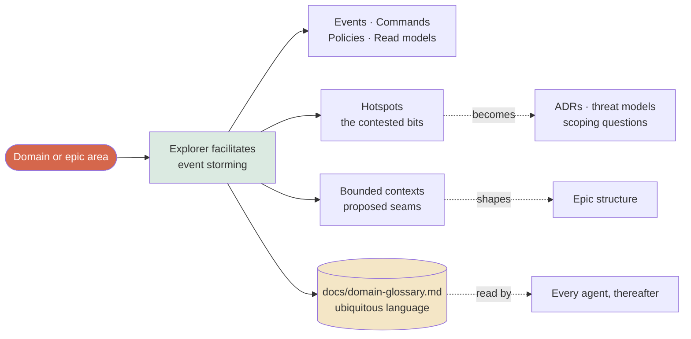

<div class="diagram-caption">Event storming as the front of refinement — its outputs feed decisions, scope, and structure</div>

- **A domain map** (`plans/{epic}/domain-map.md`) — events in the domain's language, the commands and actors behind them, the policies that connect them, the read models people need to decide.
- **Hotspots** — every contested or uncertain point, named rather than smoothed. These are the agenda for the Architect (decisions), Threat Modeller (attack surface), and Analyst (scope).
- **Proposed bounded contexts** — the real seams in the domain, which shape how epics are cut. Epics follow context boundaries instead of arbitrary feature buckets.
- **The ubiquitous language** (`docs/domain-glossary.md`) — one agreed definition per domain term, read by *every* agent thereafter so the model stays consistent from conversation to spec to story to code.

### The ubiquitous language is load-bearing

The glossary isn't documentation — it's infrastructure. It sits at the top of the structured reference layer (Tier 2), so every agent loads it first and uses its terms exactly. When the Decomposer names a story, when the Designer names a type, when the Architect writes an ADR, they speak the same language the domain map established. When any agent notices drift — a synonym creeping in, one word stretched across two concepts — it flags it rather than letting the model fracture. The Explorer owns the glossary; everyone else honours it.

This is DDD's core discipline — keep the model in the artifacts honest to the model in the conversation — made automatic.

### When the loop storms (and when it doesn't)

Storming is for when the *shape of the domain* is the open question: greenfield work, rebuilds where the model is buried in old code, contested territory, a team that doesn't yet share a model. For a small bug or a well-understood change, the loop skips it entirely — depth adapts to the work, as everywhere else in the Method.

## Recursive decomposition

After triage, the loop applies recursive decomposition. The shape of decomposition adapts to size, but the test for "are we done?" is uniform: **every leaf must pass DoR**.

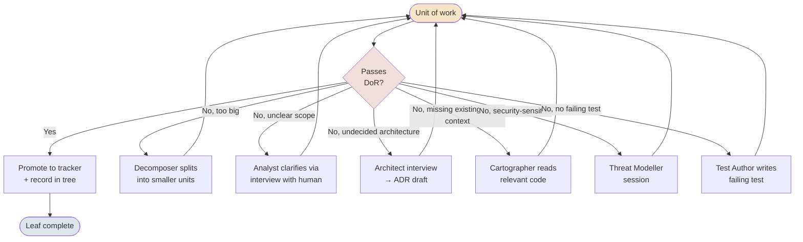

<div class="diagram-caption">Recursive decomposition — every non-leaf node loops back through DoR</div>

### Multi-epic decomposition

When triage decides a goal is too big for a single epic, the loop runs one additional layer: it decomposes the goal into epic-shaped units first, then runs the full per-epic flow.

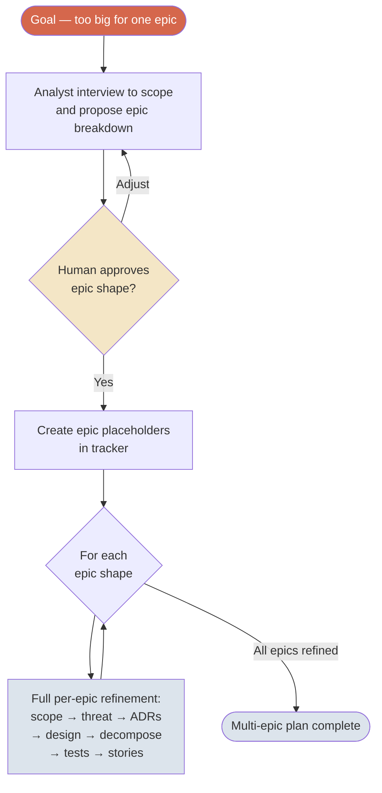

<div class="diagram-caption">Multi-epic decomposition — adds one outer loop before the per-epic flow</div>

The per-epic flow is identical to the single-epic case. Multi-epic is just an outer loop that runs the full flow N times, with shared context (gbrain memory) so each epic's threat model and ADRs can reference the others.

## Skills as internal capabilities

Skills are the method's internal patterns. They exist as named compositions of roles × modes, but they are **not the primary user surface**. The developer describes intent; the method decides which skill (or skills) to invoke.

Power users who want explicit control can still invoke them directly.

| Skill | Internal role composition | Triggered by triage when |
|---|---|---|
| `/plan` | Full panel | Intent triages to epic or multi-epic |
| `/adr` | Architect (interview + draft) | Intent triages to a durable decision with alternatives |
| `/decide` | Architect (interview) | Intent triages to a discussion-mode decision |
| `/spike` | Cartographer + Architect | Intent triages to a technical investigation |
| `/threat-model` | Threat Modeller | Intent triages to security-sensitive work, or epic kickoff |
| `/explain` | Cartographer | Intent triages to a walkthrough of existing code |
| `/review` | Critic | Intent references a PR, file, or design to review |
| `/onboard` | Cartographer + Architect | New dev orientation requested |
| `/handoff` | None (meta-skill) | End of session or "pick up where I left off" |

### Cross-skill promotion

Even when a skill starts in one mode, the conversation can produce artifacts that belong to another skill's output type. The promotion rules decide.

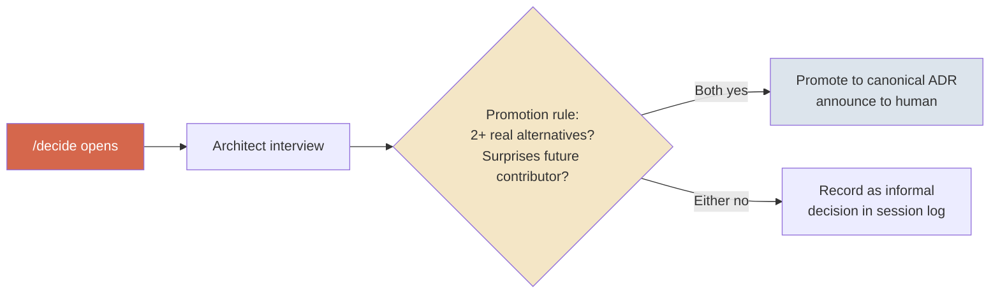

<div class="diagram-caption">Promotion rules decide what gets created — skills are entry points, not gatekeepers</div>

The same pattern applies for threat model promotion, tracker story promotion, privacy impact promotion, and compliance tag promotion. All rules are in `.method/promotion-rules.md` — transparent and tunable.

## Definition of Ready — the gate

A leaf story cannot exit refinement until it passes every criterion:

1. **Story in agreed format** ("As a [user], I want [action], so that [benefit]" — or team-agreed equivalent)
2. **Acceptance criteria are testable, single-statement** — "given X, when Y, then Z" form
3. **Estimated at ≤3 points** — anything larger must be split
4. **Dependencies identified** — by story ID or "no dependencies" tag
5. **Linked to architectural context** — an ADR ID or "no architectural impact" tag
6. **Stop conditions listed** — the standard block plus any task-specific
7. **Scope crosses ≤1 architectural boundary**
8. **A failing test exists** — written by Test Author, compiles, fails on assertion

A story that cannot be made to meet these isn't ready. It either gets split further, gets an ADR drafted, or becomes an open question.

## Stop conditions

Every leaf story carries a standard block of stop conditions as part of its spec. These are the contract for whoever implements it later — a signal that the work has hit something refinement should have resolved, and the right move is to come back to the Method, not to improvise:

- This task requires a decision not covered by linked ADRs
- Completing this would require modifying AGENTS.md, an ADR, or a skill
- Three or more attempts at the same problem without progress
- Acceptance criteria are ambiguous or contradictory
- A declared dependency is complete but its output is missing or incorrect
- A security or performance concern not addressed in the constitution has been discovered
- Completing this task would require expanding the declared scope
- No test data generator exists for this concept
- AC cannot be expressed as a single testable assertion
- Required test level (unit / integration / e2e) is unclear

The Method's job is to drive these to zero *before* a story ships — a story that trips one of these at implementation time is a refinement miss. When implementation (in the developer's own coding tool) hits one anyway, the fix is upstream: re-open the story in the Method, run `/decide` or `/adr` for a missing decision, `/storm` for a domain gap, or re-scope with the Analyst. Don't paper over it in code.

## ADRs and the promotion rule

Not every decision becomes a canonical ADR. The promotion rule:

<div class="callout">
<div class="callout-label">ADR promotion rule</div>
<p>A decision becomes a canonical ADR if (a) it would <em>surprise a future contributor</em> and (b) alternatives were <em>genuinely considered</em>.</p>
</div>

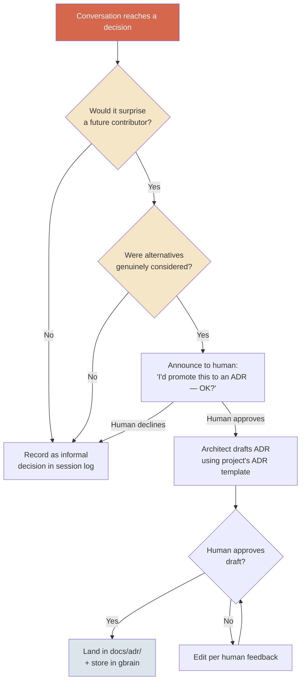

<div class="diagram-caption">ADR promotion — never silent</div>

Both conditions must hold. "We picked Postgres because of course we picked Postgres" fails (b). "We changed the variable name from `userId` to `user_id`" fails (a).

The Architect role tracks the rule continuously and surfaces candidates as the conversation proceeds. Drafts inline. Human accepts/edits/rejects. Accepted → `/docs/adr/` + gbrain. Rejected → informal note in the chat log.

ADRs are append-only — superseded, never edited.

## Testing strategy

Bottom-heavy pyramid, grounded in the project's domain-modelling and architecture ADRs (most projects benefit from a repository-pattern style separation).

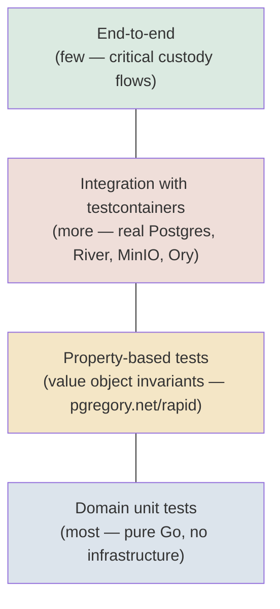

<div class="diagram-caption">The testing pyramid — bottom-heavy by design</div>

### Named test categories

- **Tenant isolation tests** — every endpoint touching tenant data has a "wrong-tenant returns no rows" adversarial test
- **Hash chain integrity tests** — any audit-touching story
- **Audit-event-emitted tests** — every mutation tests the audit event emitted in the *same transaction*
- **Compliance-tagged tests** — each test optionally carries SOC 2 / ISO 27001 control evidence tags

### The test is the spec

The Method writes the failing test *before* the story is ready, and ships it as part of the spec. Implementation happens later, in the developer's own coding tool — and it starts from a test that already exists and already fails for the right reason. That's TDD with the hardest part (writing the honest test first) already done.

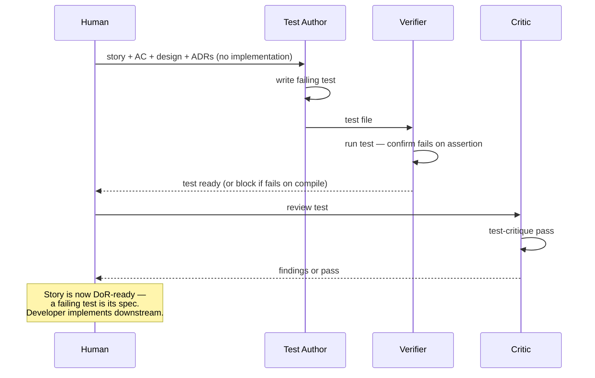

<div class="diagram-caption">The test is authored, verified, and critiqued during refinement — so the spec a developer receives is executable</div>

The Test Author never sees an implementation — there isn't one yet. That separation is what makes the test honest: it's written against the AC, not reverse-engineered from code. When a developer (or their coding agent) picks the story up, "done" is unambiguous: the test passes, for the right reason.

## Compliance baked in

Three practices, each tied to a role that ensures genuine engagement (not theatre):

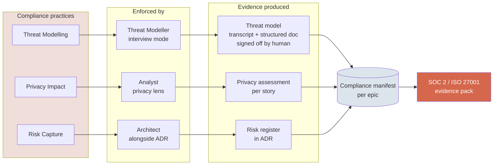

<div class="diagram-caption">Compliance baked in — engagement produces evidence as a side effect</div>

| Practice | Triggered when | Role |
|---|---|---|
| **Threat modelling** | Every epic kickoff | Threat Modeller (interview) |
| **Privacy impact** | Any node touching Confidential / Restricted data | Analyst (privacy lens) |
| **Risk capture** | Any architectural decision with material risk | Architect (alongside ADR) |

### The compliance manifest

Every completed epic plan ships with a manifest that falls out of the refinement system automatically:

```yaml
epic: cross-tenant-bulk-export
threat_model:
  performed_at: 2026-06-08T14:23Z
  drafted_by: threat-modeller-agent
  reviewed_by: engineer@yourorg
  transcript: plans/cross-tenant-bulk-export/threat-model.md
  evidence_quality: human-engaged
privacy_impacts:
  - story: STORY-142
    classification: Confidential
    reviewed_by: engineer@yourorg
adrs_produced: [ADR-021, ADR-022]
critic_findings_addressed: 3
test_coverage:
  unit: 47
  integration: 12
  property: 4
  e2e: 2
  evidenced_controls:
    soc2: [CC6.1, CC6.6, CC7.2]
    iso27001: [A.5.15, A.5.34, A.8.3]
```

**Tag priority** (June 2026 posture): SOC 2 Trust Services Criteria and ISO 27001 Annex A controls primary. NIST 800-53 tags optional, added when a FedRAMP engagement is actually triggered.

## Team pattern — convene, drive, disperse

The refinement system is inherently 1:1 — one agent talking to one human. Team alignment happens around it.

```mermaid
flowchart LR
    subgraph Convene["CONVENE (optional, ~60 min)"]
        C1[All PEs + CTPO in one room]
        C2[Drive top 1-3 layers of tree together]
        C3[Lock in scope, threat model, big ADRs]
    end

    subgraph Drive["DRIVE (solo, async)"]
        D1[Initiative Lead<br/>takes session to completion]
        D2[Agent runs in their chat]
        D3[tracker updates in real-time]
    end

    subgraph Disperse["DISPERSE (PR-shaped review)"]
        DI1[Plan-as-PR<br/>plans/epic/ directory]
        DI2[Other PEs review tree, ADRs, tests]
        DI3[Driver runs /plan resume per affected branch]
        DI4[Final plan merged]
    end

    Convene --> Drive
    Drive --> Disperse

    style Convene fill:#EFDED9
    style Drive fill:#F4E6C6
    style Disperse fill:#DCE4EC
```

<div class="diagram-caption">Team pattern — async by default, sync only when stakes warrant</div>

**Single driver by default. Convene synchronously when stakes warrant. Async review always.**

- **Convene** is for high-stakes initiatives only — rebuild kickoff, major refactor, new product surface. Skip for bug fixes, small features.
- **Drive** — Initiative Lead solo. tracker updates in real-time so the rest of the team can observe.
- **Disperse** — plan lands as a git artifact. PR-style review. Driver runs `/plan resume <node>` for affected branches.

## Memory via gbrain

gbrain is the persistence layer, accessed via MCP. Three rings:

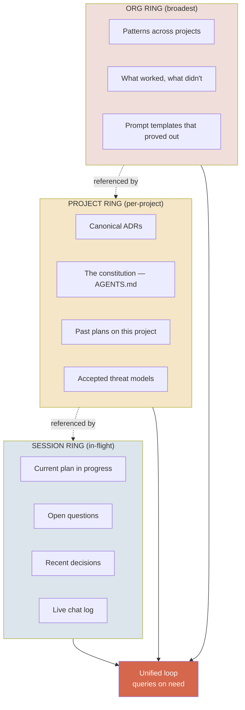

<div class="diagram-caption">Memory rings — outer rings inform inner-ring decisions</div>

The coordinator pulls outer-ring context into inner-ring decisions:

> "This decomposition looks structurally like the auth-migration plan you did 4 months ago — want me to factor that in?"

At session start: coordinator queries gbrain for relevant past plans, ADRs, patterns. During the loop: agents query as needed. At session end: plan + ADRs + lessons-learned written back to gbrain.

### gbrain is scoped per project — never globally shared

<div class="callout">
<div class="callout-label">Default scoping</div>
<p>gbrain is <em>per-project</em>. The brain that holds Project A's memory does not hold Project B's memory. Even within the same developer's local machine, each project the Method is installed into gets its own gbrain instance.</p>
</div>

When you work on multiple projects (especially for different clients), sharing a single gbrain across them creates real problems:

- **Confidentiality.** Client A's threat models and architecture decisions show up as "similar past patterns" while you're refining Client B's work.
- **Pattern confusion.** Past plans from unrelated projects surface as if they're relevant, and they aren't.
- **Audit trail mixing.** Compliance evidence (which is per-project) becomes harder to extract cleanly.

The Method's install (`AGENT_INSTALL.md` Step 6a) sets gbrain up scoped to the current project by default. Two valid backends:

| Backend | Use when |
|---|---|
| **Local PGLite** | Solo work or single-machine development. Zero infrastructure. Isolated by default. |
| **Dedicated Supabase project** | Multi-dev team on this project. Brain is shared *among that project's team* — never across projects. |

The `.gbrain-source` pin file at the repo root is what scopes gbrain queries to this worktree. The global `~/.gbrain/config.json` may point at a different brain for a different project; gbrain reads the worktree-pinned config when you're in this directory.

**Anti-pattern:** pointing two different projects' `.gbrain-source` files at the same Supabase URL. Don't do this even if they're for the same employer — the org ring will leak patterns across the projects.

## The three-tier context model

Agents need information to make decisions. *Where* information lives shapes how the method behaves. The method uses three distinct tiers.

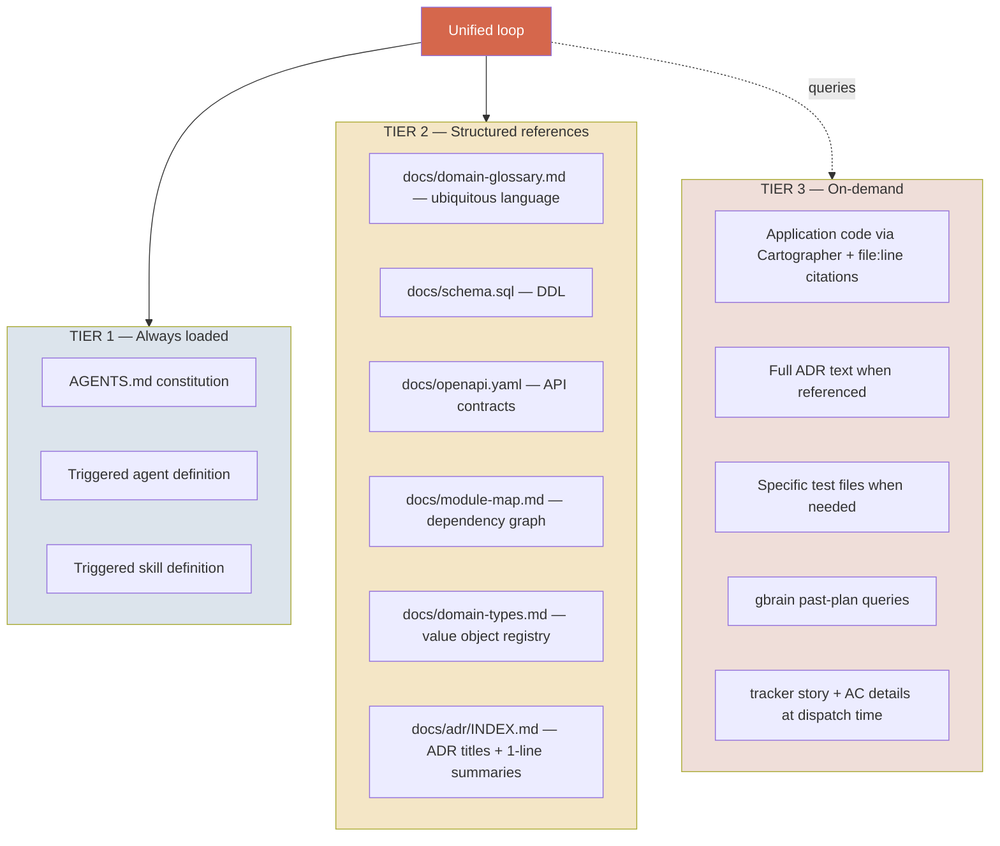

<div class="diagram-caption">Three tiers of context — different load patterns, different update cadences</div>

### Tier 1 — Always loaded

The baseline every agent sees from session start, regardless of task:

- `AGENTS.md` — the project's constitution
- The triggered agent's system prompt (e.g., `.claude/agents/architect.md`)
- The triggered skill's instructions (e.g., `.claude/commands/plan.md`)

Small (~10–20K tokens). Changes only when the constitution or a role definition is intentionally updated. Loaded mechanically.

### Tier 2 — Structured references

Project-specific files that **constrain** decisions without describing implementation detail. Loaded at session start when present.

| File | Why it's high-leverage |
|---|---|
| `docs/domain-glossary.md` | The ubiquitous language is the backbone of the model. Loaded first, used by every agent, so the same word means the same thing from conversation to spec to story. The Explorer owns it; any agent that notices drift flags it rather than letting it spread. |
| `docs/schema.sql` | The data shape constrains every domain decision. Designer can't accidentally specify a column that conflicts with reality. Test Author writes fixtures that match. Architect spots decisions that contradict the schema before drafting an ADR. |
| `docs/openapi.yaml` | Existing API contracts constrain every endpoint decision. The Designer adds endpoints consistent with current patterns; the Critic spots inconsistencies. |
| `docs/module-map.md` | The dependency graph constrains every cross-module decision. The Decomposer doesn't propose breaking module boundaries; the Critic catches violations. |
| `docs/domain-types.md` | The registry of value objects + domain primitives constrains every domain decision. New types added cleanly; existing types referenced precisely. |
| `docs/adr/INDEX.md` | An index of accepted decisions (titles + 1-line summaries) lets agents know which decisions exist without loading all of them. Full ADR text is loaded on-demand when referenced. |

Each file is small (~1–5K tokens). The whole structured reference layer is bounded (~20–50K tokens). Changes infrequently — typically auto-regenerated via CI on relevant code changes (e.g., `docs/schema.sql` regenerated after every Atlas migration).

**These files are project-specific.** The method *reads them when present*; the project *generates and maintains them*. If a file doesn't exist in a project, agents skip it without failing.

### Tier 3 — On-demand

Information loaded only when a specific need arises:

- **Application code** — read by the Cartographer with mandatory `file:line` citations. Application code is large and changes constantly; pre-loading it guarantees staleness and burns context. On-demand reads keep agents honest.
- **Full ADR text** — loaded when an ADR is referenced in conversation. The INDEX (Tier 2) tells agents which ADRs exist; the full text is loaded only when the conversation actually needs the rationale.
- **Specific test files** — read by Test Author or Critic when working on adjacent functionality.
- **gbrain queries** — past plans, similar threat models, prior decisions pulled in when the orchestrator detects a pattern match.
- **tracker story details** — fetched at dispatch time, not at session start.

### Why this matters

Two consequences:

**Schema-grounded refinement from the first turn.** Without Tier 2, the Cartographer has to grep the codebase every time someone asks "what does X look like in our data model?" With Tier 2, every agent sees the schema from session start. The Designer's first draft is grounded in reality; the Architect spots conflicts before drafting an ADR.

**Citation discipline preserved for application code.** Application code stays in Tier 3 specifically because the Cartographer's `file:line` citation pattern is more honest than "I remember reading this." Pre-loading code would erode that discipline; structured references in Tier 2 don't, because they're declarative not interpretive.

### Keeping structured references fresh

Each tier-2 file has an ideal refresh trigger:

| File | Refreshed when |
|---|---|
| `docs/domain-glossary.md` | Every `/storm` session, and whenever a new domain term is agreed (maintained by the Explorer, not CI) |
| `docs/schema.sql` | After every Atlas migration (or equivalent migration tool runs) |
| `docs/openapi.yaml` | On every API change (generated from code, or hand-maintained) |
| `docs/module-map.md` | On every cross-module dependency change (CI script) |
| `docs/domain-types.md` | On every value object / domain primitive change (CI script) |
| `docs/adr/INDEX.md` | On every ADR addition or supersession (auto-regenerated by `/adr` skill) |

CI hooks make this mechanical. A drift between code state and Tier 2 files is the project's bug to fix, not the method's responsibility.

## Failure modes and mitigations

The system will produce wrong things. Design for it.

### Known failure modes

- **AI confidence on wrong things.** Cartographer mis-reads code; Architect proposes a decision contradicting an existing ADR; Decomposer misses an obvious dependency; Critic dismisses a real issue.
- **Hallucinated alternatives.** Architect cites "option C" that doesn't really exist.
- **Consensus illusions.** Multiple agents trained on the same patterns agreeing on the same wrong thing.
- **Drift.** ADRs accepted, code drifts, no one notices.
- **Vacuous tests.** Test Author writes tests that compile and pass but don't exercise the behaviour they're meant to.
- **Interview drift.** Threat Modeller produces generic STRIDE output that doesn't engage the engineer's domain knowledge.

### Baked-in mitigations

- **Citation discipline.** Every claim about existing code carries a `file:line` reference. Every ADR reference carries the ADR ID. The orchestrator rejects unsourced claims.
- **Critic is adversarial by default**, not consensus. Two passes (test critique + code critique).
- **Verifier confirms tests fail for the right reason** before a story is marked ready.
- **Hash artifacts.** Every ADR, tree state, test file gets a content hash. Drift detection becomes mechanical.
- **Periodic constitution check.** `/audit-constitution` (v2) — Cartographer-led, flags ADRs whose stated invariants don't hold in code.
- **Trigger profiles are transparent.** Humans can read the conditions and tune them.
- **Anti-theatre check.** Threat Modeller refuses to produce a canonical threat model from a disengaged interview.

## Storage and artifacts

```
plans/{epic-slug}/
  tree.yaml            ← structured tree state, diffable in PR review
  conversation.md      ← full raw chat log (audit trail, not the artifact)
  scope.md             ← cleaned + signed scope brief
  threat-model.md      ← cleaned + signed threat model
  design.md            ← design doc from Designer
  decisions.md         ← informal decisions captured during the session
  tests/               ← failing test specs from Test Author
  manifest.yaml        ← compliance evidence pack

.method/handoffs/
  LATEST.md            ← pointer to the most recent handoff
  {ISO-timestamp}-{slug}.md  ← per-handoff snapshots, accumulate over time

docs/adr/
  ADR-XXX.md           ← promoted, accepted ADRs

AGENTS.md              ← the constitution (root)

.claude/
  agents/              ← role agent definitions
  commands/            ← skill definitions (internal capabilities)

.method/
  triggers.md          ← role invocation conditions
  promotion-rules.md   ← canonical artifact promotion rules

gbrain/
  (session / project / org rings, accessed via MCP)
```

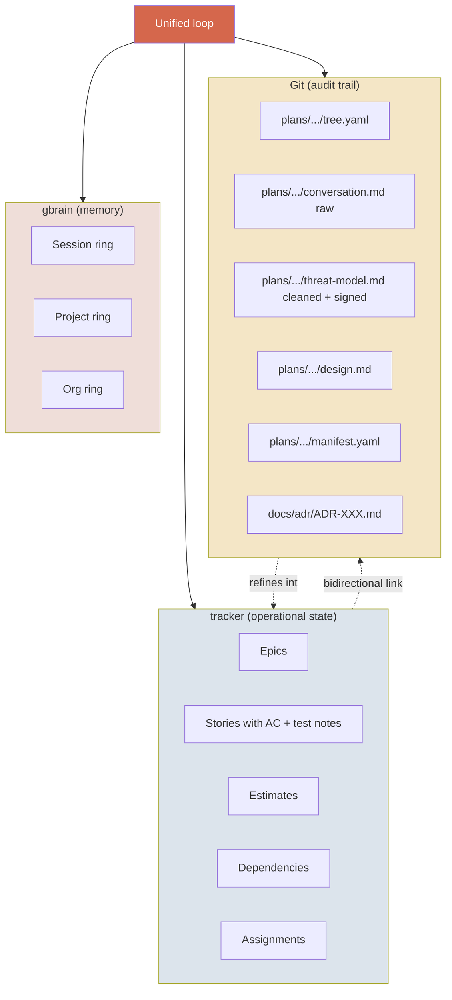

<div class="diagram-caption">tracker holds operational state. Git holds the audit trail. gbrain holds memory.</div>

Bidirectional traceability: every tracker story has a link to its git plan artifact. Every tree.yaml leaf records its tracker story ID.

## Where the Method ends: the handoff to build

The Method stops at a ready spec. It does not write your production code.

This is a deliberate boundary, not a missing feature. Implementation is the part of the SDLC that AI coding tools — Claude Code, Cursor, Codex — already do well. Pointing one of them at a story that carries testable AC, a failing test, linked ADRs, a threat model, and a domain glossary is a fundamentally easier task than pointing it at "add a bulk export feature." The Method's whole thesis is that **the leverage is upstream**: get the spec right and the build gets dramatically easier, regardless of which tool does it.

So the handoff is the product. A story leaving the Method carries everything an implementer — human or agent — needs:

```
tracker story (Ready)
├── testable acceptance criteria
├── a failing test that defines "done"        → plans/{epic}/tests/{story}_test.go
├── linked ADRs (the decisions already made)  → docs/adr/
├── the domain glossary (ubiquitous language) → docs/domain-glossary.md
├── threat model + privacy notes where relevant
└── stop conditions (when to come back, not improvise)
```

The implementer's job is the smallest it can be: make the failing test pass, honour the linked decisions, respect the constitution. When they hit a wall, the stop conditions tell them it's a refinement gap — and the door back into the Method is open (`/decide`, `/adr`, `/storm`, re-scope). The flow is one-directional by design — refinement feeds build — but build can always send a question back upstream, because the spec, the decisions, and the conversation that produced them are all still there in git.

<div class="callout">
<div class="callout-label">Why not own the build too?</div>
<p>Earlier versions did. It was the wrong shape. Build tooling is a crowded, fast-moving, commodity space — every coding agent ships it, and ships it well. Refinement is the neglected, high-leverage, hard-to-do-well part. The Method does one thing: it makes the upstream thinking cheap and rigorous, and hands off a spec any build tool can execute.</p>
</div>

<a id="configuration"></a>
## Configuration

The Method's structured settings live in **`method.config.yaml`** at the project root. Constitution (prose, conventions, principles) lives in `AGENTS.md`. Credentials and MCP server registration live in `~/.claude/mcp.json` (per-user, never in git).

The three files have distinct responsibilities:

| File | Audience | What it holds | Committed to git? |
|---|---|---|---|
| **`method.config.yaml`** | Tooling + agents | Structured settings (tracker, story sizing, compliance, testing) | Yes — shared per project |
| **`AGENTS.md`** | Humans + agents | Prose constitution (principles, conventions, stack table) | Yes — shared per project |
| **`~/.claude/mcp.json`** | Claude Code | MCP server URLs, API tokens, auth | No — per-user, never git |

### `method.config.yaml` schema

Sensible defaults are embedded; any missing field falls through. A minimal config that uses no tracker is two lines:

```yaml
method_version: 1.2.0
tracker:
  type: none
```

Full schema:

```yaml
method_version: 1.2.0

# Operational tracker
tracker:
  type: linear            # linear | jira | github-issues | none
  mcp_server: linear      # MCP server name in ~/.claude/mcp.json

  # Tracker-specific blocks — only the block matching `type` is read
  linear:
    team_id: TEAM_ABC123

  jira:
    site: company.atlassian.net
    project_key: PROJ
    epic_issue_type: Epic
    story_issue_type: Story
    points_custom_field: customfield_10016

  github_issues:
    owner: your-org
    repo: your-repo
    epic_label: epic
    story_label: story

# Story sizing
story_points:
  scale: fibonacci        # fibonacci | t-shirt | custom
  ceiling: 3              # DoR rejects stories above this

# Story format
story_format: user-story  # user-story | technical | freeform

# Compliance (for test tagging — empty list = no tagging)
compliance:
  frameworks: []          # e.g. [soc2, iso27001, hipaa, fedramp]

# Testing
testing:
  race_detector_required: true
  property_tests_for_value_objects: true
```

### Defaults

| Setting | Default | When it kicks in |
|---|---|---|
| `tracker.type` | `none` | No remote tracker; tree.yaml is the operational state |
| `tracker.mcp_server` | `null` | Skip tracker MCP invocations |
| `story_points.scale` | `fibonacci` | Decomposer uses 1, 2, 3, 5, 8, 13 |
| `story_points.ceiling` | `3` | DoR rejects anything above |
| `story_format` | `user-story` | Decomposer drafts "As a..., I want..., so that..." |
| `compliance.frameworks` | `[]` | No test tagging |
| `testing.race_detector_required` | `true` | Verifier requires race-detector pass |
| `testing.property_tests_for_value_objects` | `true` | Verifier requires property tests on value objects |

If `method.config.yaml` is missing entirely, agents proceed with all defaults and skip any tracker MCP invocations.

### How agents use it

When an agent in a skill needs to invoke a tracker (e.g., `/plan` pushing a story to Linear):

1. Read `method.config.yaml`
2. See `tracker.type: linear`, `tracker.mcp_server: linear`
3. Pull the `tracker.linear` block for the team ID
4. Invoke the `linear` MCP server with the team ID + story payload

Skill prompts stay generic — *"push the story to the configured tracker"* — and agents translate to the tracker's native vocabulary when calling MCP.

### How tooling uses it

`install.sh`, `scripts/sync-*.sh`, and any future migration tools read `method.config.yaml` for project-specific settings. The config is structured YAML so any standard parser can read it. There's no validation layer yet; structural correctness is the user's responsibility.

## Distribution and versioning

The method ships as a set of markdown files (agent definitions, skill definitions, trigger profiles, templates) that install into a project's directory. Claude Code auto-discovers them; no plugin system or global install is needed.

### Install path

```bash
curl -sSL https://raw.githubusercontent.com/nlawstudio/ai-refinement-method/main/install.sh | sh
```

The script clones the method repo and copies the framework files into the target directory. Existing files (`AGENTS.md`, `docs/adr/`, live `plans/{epic}/` directories) are preserved.

See [INSTALL.md](INSTALL.md) for full setup including gbrain MCP and tracker MCP wiring.

### What ships

| Category | What |
|---|---|
| Role definitions | Ten agent files in `.claude/agents/` |
| Skill definitions | Ten skill files in `.claude/commands/` |
| Trigger profiles | `.method/triggers.md` |
| Promotion rules | `.method/promotion-rules.md` |
| Templates | `plans/_templates/tree.yaml.example`, `plans/_templates/manifest.yaml.example` |
| Constitution skeleton | `AGENTS.template.md` (becomes `AGENTS.md` in the target if not already present) |
| Documentation | `METHOD.md`, `TUTORIAL.md`, `INSTALL.md` |

### What does NOT ship

| Category | Why not |
|---|---|
| Project-specific ADRs | They live in the project repo's `docs/adr/`, not in the method |
| Live `plans/{epic}/` directories | These accumulate as the method is used per-project |
| The method's own README and CHANGELOG | Those are for the method repo, not the target project |

### Versioning

Versions follow SemVer in `VERSION`. Major releases when the role panel or core loop changes; minor releases for new skills, new trigger conditions, or restructures; patch releases for prompt-tuning fixes.

| Version | Shape |
|---|---|
| **0.1.0** | Initial refinement-phase scaffold. Original validation project bundled. |
| **0.2.0** | Packaged tool. Refinement + build phase + off-course bridge. Validation instance separated; Method is project-agnostic. |
| **1.0.0** | Renamed from Harness to Method to disambiguate from agent-runtime "harness" vocabulary. |
| **1.1.0** | Tracker-agnostic (Linear / Jira / GitHub Issues / none). |
| **1.2.0** | Structured `method.config.yaml` config file; credentials separated to `~/.claude/mcp.json`. |
| **1.2.1** | Tutorial rewritten as a 15-minute quickstart. |
| **1.2.3** | First public release (open source, MIT). |
| **1.2.4** | Standard OSS scaffolding (license, contributing, security, CI). |
| **2.0.0** | Refocused on spec generation. Build phase removed (Builder, `/build`, `/off-course`). Added the Explorer role and `/storm` for event-storming domain discovery, the ubiquitous-language glossary, and an explicit push-back/anti-sycophancy spine across the interviewing agents. |
| 2.1.0+ | TBD as the Method is used and tuned |

`CHANGELOG.md` tracks what changed at each version. Git tags mark releases; GitHub releases include release notes.

### Upgrading

To upgrade an existing installation:

```bash
curl -sSL https://raw.githubusercontent.com/nlawstudio/ai-refinement-method/main/install.sh | sh
```

The script preserves your `AGENTS.md` and `docs/adr/`. It only overwrites the framework files. Check `CHANGELOG.md` before upgrading to see what changed.

## What's out of scope

Explicitly not addressed by the Method:

- **Implementation.** The Method produces ready specs; it does not write production code. That's your coding tool's job. See "Where the Method ends" above.
- **Sprint cadence.** Cycle structure, weekly rhythm, recovery time. A team decision the Method deliberately doesn't prescribe.
- **CI/CD, deployment, and release automation.** Downstream of the spec.
- **Hiring, business strategy, and operating model.**

## Tuning the Method to your project

The Method ships with defaults; a few things are worth setting deliberately when you adopt it:

1. **Story format and point scale.** Set your scale (Fibonacci, t-shirt, custom) and story format in `method.config.yaml` before relying on the Decomposer's estimates.
2. **Definition of Ready.** If your team already has a DoR, reconcile it with the canonical eight-point version above — keep the test-exists criterion, adapt the rest.
3. **Compliance vocabulary.** Set your frameworks (SOC 2, ISO 27001, etc.) in `method.config.yaml` so the Threat Modeller and compliance tagging speak your auditor's language.
4. **Tracker wiring.** Connect your tracker MCP so `/plan` can promote stories; until then, the git `tree.yaml` is the operational state.
5. **First run.** Pick one small, real piece of work and run the loop end-to-end. Tune the agent prompts (`.claude/agents/*.md`) from what you learn — they're yours once installed.

## Glossary

| Term | Definition |
|---|---|
| **ADR** | Architecture Decision Record. Append-only, immutable once accepted. |
| **AGENTS.md** | The constitution. Linux Foundation open standard for agent project instructions. |
| **Analyst** | Role: scope discovery (interviewing) and privacy lens (drafting). |
| **Architect** | Role: surfaces and resolves decisions; drafts ADRs. |
| **Bounded context** | A DDD boundary within which a domain model and its language apply consistently. Surfaced by the Explorer; shapes epic structure. |
| **Cartographer** | Role: reads existing code, produces cited findings. |
| **Constitution** | The set of shared decisions encoded in AGENTS.md + ADRs. |
| **Critic** | Role: adversarial review on tests (during refinement) and on PRs/code/designs (on-demand via /review). |
| **Domain map** | The Explorer's output: events, commands, policies, read models, hotspots, and proposed bounded contexts. |
| **Decomposer** | Role: breaks design into DoR-ready story tree. |
| **Designer** | Role: produces design docs from brief + ADRs + Cartographer's map. |
| **DoR** | Definition of Ready. The eight-point checklist a leaf story must pass to exit refinement. |
| **Doing** | Agent mode: AI acts autonomously, no human signoff in the moment. |
| **Drafting** | Agent mode: AI generates a draft, human signs off. |
| **Epic** | A multi-week scoped outcome with a single owning metric. |
| **Event storming** | A collaborative domain-discovery practice — mapping domain events, commands, policies, and hotspots. The Explorer runs it as a conversation. |
| **Explorer** | Role: facilitates event storming, maps the domain, owns the ubiquitous-language glossary. |
| **gbrain** | The memory layer. Per-project scoped. Accessed via MCP. |
| **Hotspot** | A point of contention or uncertainty surfaced during event storming — flags where an ADR, threat model, or scoping decision is needed. |
| **Initiative Lead** | The PE leading the current epic. Rotates per epic. |
| **Interviewing** | Agent mode: AI asks, human answers, AI cleans/structures/augments, human signs off. |
| **Loop** | The unified refinement loop — same shape, depth adapts to input. |
| **Mode** | One of doing / drafting / interviewing. |
| **Multi-epic decomposition** | Pre-step that runs when a goal is too big for a single epic. |
| **Plan-as-PR** | Pattern of treating refinement output as a versioned git artifact reviewed like code. |
| **Promotion rule** | The conditions under which a conversation produces a canonical artifact. |
| **Role** | An agent primitive. Ten exist in this framework. |
| **Skill** | An internal capability composing roles × modes. Not the user-facing surface. |
| **Story** | A leaf work item that meets DoR. Estimated at ≤3 points. |
| **Stop condition** | An explicit trigger documented on a story — signals that implementation hit a refinement gap and should return to the Method. |
| **Test Author** | Role: writes the failing test from AC. Does not see implementation. The test is the spec a developer later builds against. |
| **Threat Modeller** | Role: drives STRIDE-style threat modelling interview at epic kickoff. |
| **Triage** | The first step of the unified loop — determining input shape and depth. |
| **Trigger profile** | The conditions under which a role gets invoked. Transparent to humans. |
| **Ubiquitous language** | The project's agreed domain vocabulary, captured in `docs/domain-glossary.md` and read by every agent. A DDD concept; the Explorer maintains it. |
| **Unified loop** | The single primary interaction pattern — triage → recursive decomposition → tracker + git. |
| **Verifier** | Role: the DoR gate — confirms a leaf passes all eight readiness criteria. |
