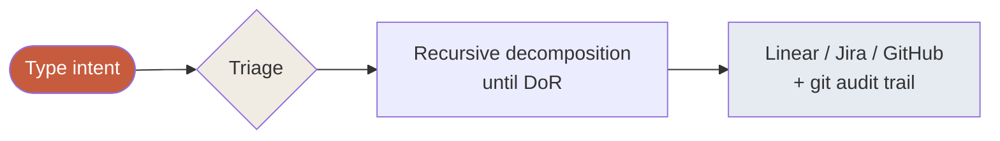

<div class="cover">

<div class="eyebrow">Quickstart · zero to first refined story</div>

# Up and running,<br>in 15 minutes

<div class="subtitle">Install the Method, make your first decision, refine your first story. This gets you moving; METHOD.md has the depth.</div>

</div>

<div class="toc">

<div class="toc-label">Contents</div>

<ol>
<li><a href="#what-the-method-is">What the Method is</a></li>
<li><a href="#install-3-minutes">Install (3 minutes)</a></li>
<li><a href="#first-a-decision-2-minutes">First: a decision (2 minutes)</a></li>
<li><a href="#next-a-bug-10-minutes">Next: a bug (10 minutes)</a></li>
<li><a href="#going-bigger">Going bigger</a></li>
<li><a href="#the-mental-model">The mental model</a></li>
<li><a href="#where-artifacts-land">Where artifacts land</a></li>
<li><a href="#when-something-feels-wrong">When something feels wrong</a></li>
<li><a href="#quick-answers">Quick answers</a></li>
<li><a href="#where-to-go-next">Where to go next</a></li>
</ol>

</div>

## What the Method is

Code got cheap. Spec quality is the new bottleneck. The Method points AI at the upstream work — event storming, domain-driven design, refinement — where being wrong is cheap and being right compounds.

It's not dictation, and it's not vibe coding. The AI is a thinking partner — it brings expertise, surfaces the gaps, and *pushes back* on weak reasoning. You bring taste, domain knowledge, and the final call. You stay the author; the Method makes you a sharper one.

Under the hood it layers **ten specialised agents** and **twelve skills** on top of Claude Code, governed by a constitution your project owns. You describe what you want in plain language; the Method figures out the shape of the work and runs the right depth of refinement.

<div class="callout">
<div class="callout-label">In one sentence</div>
<p>The Method turns fuzzy intent into a ready spec — domain mapped, decisions captured, threats modelled, stories testable — that any coding tool can build from. It stops at the spec; it doesn't write your production code. <em>That's the point.</em></p>
</div>

## Install (3 minutes)

In your project directory, ask your AI coding agent (Claude Code, Cursor, Codex):

> *Install the agentic refinement method in this repo. Follow the instructions at https://github.com/nlawstudio/ai-refinement-method/blob/main/AGENT_INSTALL.md*

The agent walks you through a guided install: captures your project context, sets up `AGENTS.md` and `method.config.yaml`, helps you bring in ADRs, wires up gbrain and your tracker MCP, smoke-tests with `/onboard`. ~10–30 minutes depending on how much you customise.

There's also a direct script if you want the files in place first:

```bash
curl -sSL https://raw.githubusercontent.com/nlawstudio/ai-refinement-method/main/install.sh | sh
```

Either way, run the agent install prompt — it's what makes the Method specific to *your* project. Details in the [README](https://github.com/nlawstudio/ai-refinement-method#install).

## First: a decision (2 minutes)

Pick any architectural question already on your plate and type it. No skill name, no setup:

```
Should custody transfers require a hardware MFA challenge, or is session MFA enough?
```

The Method routes to the **Architect** in interview mode. It asks about your context, names the real alternatives, and pushes back where your reasoning is thin:

<div class="chat">

<div class="turn">
<span class="role agent">Architect</span>
<div class="body">
Real alternatives here: hardware MFA every transfer, session MFA only, step-up (default to session, force hardware on staleness), or two-person rule. The first doesn't scale at 50/day. The last is too heavy for everyday flow. Step-up is the right shape — but the threshold matters. Time-based, count-based, or sensitivity-flag-based?
</div>
</div>

<div class="turn">
<span class="role human">You</span>
<div class="body">
count + time, whichever hits first. plus always for flagged sensitive
</div>
</div>

<div class="turn">
<span class="role agent">Architect</span>
<div class="body">
This is shaping up as a durable decision with real alternatives considered — promoting to an ADR. <em>OK?</em>
</div>
</div>

</div>

If the promotion rule fires (real alternatives existed, and the decision would surprise a future contributor), you get a fully-drafted ADR in `docs/adr/` — your casually-typed reasoning structured into the project's template, approved by you. If it's just a tactical default, the decision is logged informally instead. Either way, no more *"I remember we discussed this six weeks ago..."*.

## Next: a bug (10 minutes)

Pick a small bug:

```
Fix the bug where wallet linkage fails for Solana addresses
```

The Method triages it as a bug and runs the lightweight flow:

1. **Cartographer** locates the issue in your code and cites it — every claim with a `file:line` reference
2. **Analyst** confirms scope with you (and fences off the tempting adjacent refactor)
3. **Test Author** writes a failing test from the acceptance criteria — verified to compile and fail for the right reason
4. The story lands in your tracker, ready for a developer to make the test pass

No threat model (not security-sensitive), no ADR (no real decision), no design doc (mechanical fix). Right depth for the shape.

You've gone from *"I should fix that bug"* to *"here's the failing test that defines the fix"* in ten minutes. The implementation is a five-minute job in your own coding tool — because the spec is now airtight.

That's the Method. Everything else is variation on this loop.

## Going bigger

Same loop, different depth. For each shape of input, a different set of outputs:

| You type | Outputs |
|---|---|
| *"Should we use X or Y?"* | An ADR (if alternatives are real) or an informal decision logged |
| *"Map the domain for X"* | A domain map — events, policies, hotspots, bounded contexts — plus the ubiquitous-language glossary |
| *"How does X work in our codebase?"* | A cited code walkthrough — every claim has a `file:line` reference |
| *"Fix the X bug"* | One tracker story with a failing test as the spec |
| *"Add feature X"* | A refined epic with stories, ADRs, threat model, tests, compliance manifest |
| *"Rebuild the platform"* | A multi-epic plan with all the above for each epic, sequenced |
| *"Threat-model this integration"* | A signed threat model with engineer's engagement recorded |
| *"Review PR 142"* | Structured adversarial findings with severity |

An epic runs the full flow — scope interview, mandatory threat model, decision interviews, design doc, story tree — and takes ~90 minutes of your engagement. The result: a dozen DoR-ready stories in your tracker, each with acceptance criteria, points, linked ADRs, and a failing test. When the domain itself is unclear, the Method storms it first (`Map the domain for X`) so the epics get cut along real seams.

Every output is structured. Every output is in git. **Nothing important leaves your head without being recorded.**

## The mental model

One loop. Three sentences:

> Type your intent. The Method triages it. It decomposes recursively until every leaf passes Definition of Ready, with the right artifacts landing in the right places.



<div class="diagram-caption">The whole Method in one diagram</div>

Depth varies. Loop shape doesn't. Triage is interview-led when uncertain — if the Method can't tell what shape your intent is, it asks, and you can always override.

Every agent output is in one of three modes. Knowing them tells you when to expect a question vs. just results:

| Mode | Pattern | When |
|---|---|---|
| **Doing** | AI acts, no signoff | Mechanical work — reading code, running tests |
| **Drafting** | AI drafts → human signs off | Tests, decompositions, designs |
| **Interviewing** | AI asks → challenges → human answers → AI structures → human signs off | Domain mapping, scope, decisions, threat modelling |

The interview pattern matters most — and it's a partnership, not a transcription. You don't have to type beautifully; the AI structures your thinking into the final artifact, and sharpens it on the way.

## Where artifacts land

| Place | What lands there | Why |
|---|---|---|
| **Your tracker** (Linear / Jira / GitHub Issues) | Epics and stories with AC, test notes, estimates, dependencies | Operational day-to-day |
| **Git** (`plans/{epic}/`, `docs/adr/`) | Scope briefs, threat models, design docs, failing tests, compliance manifests, ADRs, the raw conversation | The audit trail you'd show an auditor |
| **gbrain** | Past plans, accepted ADRs, project patterns | Cross-session memory, scoped per project |

No tracker? Set `tracker.type: none` in `method.config.yaml` and the git `tree.yaml` becomes the operational state.

## When something feels wrong

The agents are wrong sometimes. Push back — the Method assumes you will, and records every pushback:

| Situation | What to do |
|---|---|
| Uncited claim about existing code | *"Cite that. I won't act on uncited claims."* |
| ADR promoted that shouldn't be (or vice versa) | *"Disagree — no real alternative here."* / *"Promote anyway — here's why."* |
| Triage picked the wrong shape | *"This isn't a story, it's an epic. Restart routing."* |
| Story tree shape feels off | *"Redo this — split by Y instead of X."* |
| A test doesn't exercise the behaviour | *"This is vacuous. Rewrite."* |

And three habits that cover most rough edges:

- **Long session?** Run `/handoff` to save state; `/handoff resume` next session picks up exactly where you left off — even days later, even in a different agent.
- **Tracker or gbrain not connected?** Everything still works — `/plan` runs in dry-run mode (all git artifacts, no tracker push) until the MCP is wired up.
- **An agent keeps making the same mistake?** Its prompt is just markdown — edit `.claude/agents/{name}.md` and the change applies immediately.

## Quick answers

**Do I have to use the Method for everything?** No. For a five-line fix, just fix it. The Method is for work where the *upstream thinking* matters.

**Can I invoke skills directly?** Yes — `/storm`, `/adr`, `/decide`, `/spike`, `/explain`, `/threat-model`, `/review`, `/onboard`, `/plan`, `/handoff`. Intent-routing is the default, not the only path.

**Will gbrain leak between client projects?** No — gbrain is scoped per project, never globally shared. See METHOD.md "Memory via gbrain".

**What if this is over-engineered for us?** Then you've shipped a few epics with high-quality refinement and compliance evidence as a side effect. Scale it back, keep the parts you want — the downside is bounded.

## Where to go next

1. **[METHOD.md](METHOD.md)** — the canonical spec: the role panel, triage, Definition of Ready, promotion rules, compliance, failure modes
2. **`AGENTS.md`** (in your installed project) — the constitution every agent reads at session start; customise it
3. **[.method/triggers.md](.method/triggers.md)** and **[.method/promotion-rules.md](.method/promotion-rules.md)** — when agents fire and when artifacts become canonical; both tunable
4. **`/onboard`** — run it in your installed project for an orientation generated against *your* codebase
