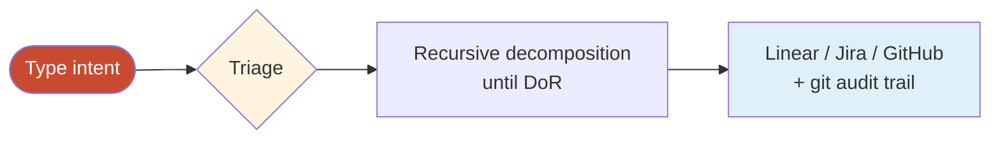
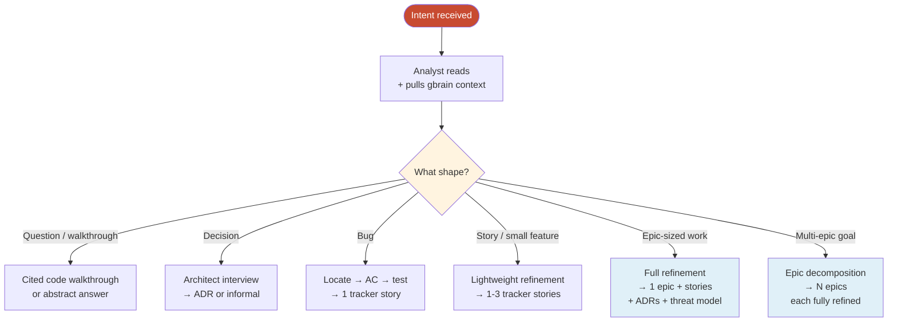
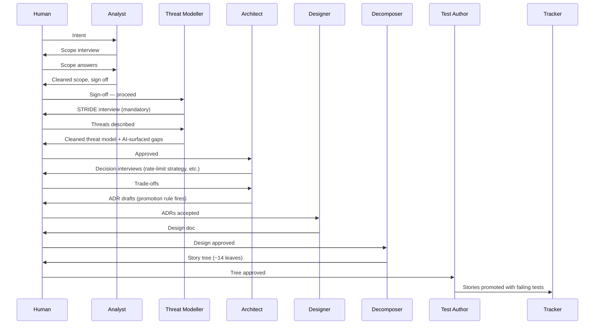
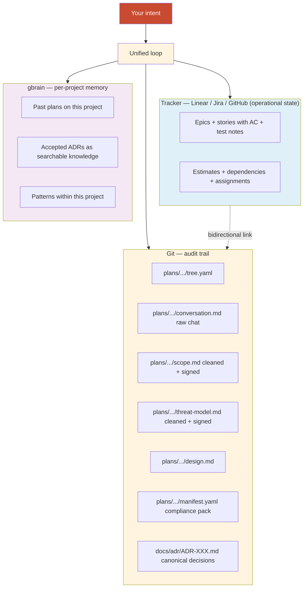

<style>
@import url('https://fonts.googleapis.com/css2?family=Inter:wght@300;400;500;600;700&family=JetBrains+Mono:wght@400;500;600&display=swap');

:root {
  --bg: #F7F5F0;
  --ink: #14110F;
  --muted: #6F665A;
  --line: #E5E0D5;
  --accent: #C84B31;
  --dark: #14110F;
  --code-bg: #EEEAE0;
  --chat-bg: #FBFAF6;
  --human: #C84B31;
  --agent: #2B5F8E;
}

html, body { background: var(--bg); color: var(--ink); margin: 0; padding: 0; }

body {
  font-family: 'Inter', -apple-system, BlinkMacSystemFont, sans-serif;
  font-size: 17px;
  line-height: 1.65;
  letter-spacing: -0.005em;
  max-width: 820px;
  margin: 0 auto;
  padding: 80px 48px 160px;
}

h1 { font-size: 56px; font-weight: 700; letter-spacing: -0.035em; line-height: 1.05; margin: 0 0 24px 0; }
h2 {
  font-size: 32px; font-weight: 600; letter-spacing: -0.025em; line-height: 1.2;
  margin: 80px 0 24px 0; padding-top: 32px; border-top: 1px solid var(--line);
}
h2::before {
  content: "§ " counter(h2-counter, decimal-leading-zero);
  counter-increment: h2-counter;
  display: block;
  font-family: 'JetBrains Mono', ui-monospace, monospace;
  font-size: 12px; letter-spacing: 0.18em; text-transform: uppercase;
  color: var(--accent); font-weight: 600; margin-bottom: 14px;
}
body { counter-reset: h2-counter; }
h3 { font-size: 22px; font-weight: 600; letter-spacing: -0.015em; line-height: 1.3; margin: 40px 0 16px 0; }
h4 {
  font-family: 'JetBrains Mono', ui-monospace, monospace;
  font-size: 13px; font-weight: 600; letter-spacing: 0.12em; text-transform: uppercase;
  color: var(--muted); margin: 32px 0 12px 0;
}
p { margin: 0 0 18px 0; }
ul, ol { margin: 0 0 18px 0; padding-left: 22px; }
li { margin-bottom: 8px; }
li::marker { color: var(--accent); }
strong { font-weight: 600; }
em { color: var(--accent); font-style: normal; font-weight: 500; }
code {
  font-family: 'JetBrains Mono', ui-monospace, monospace;
  font-size: 0.85em; background: var(--code-bg);
  padding: 2px 7px; border-radius: 4px;
}
pre {
  background: var(--dark); color: #F0EBE0;
  padding: 22px 26px; border-radius: 8px;
  font-size: 14px; line-height: 1.6; margin: 24px 0; overflow-x: auto;
}
pre code { background: transparent; color: inherit; padding: 0; font-size: 1em; }

table { width: 100%; border-collapse: collapse; margin: 20px 0 28px 0; font-size: 15px; }
th {
  text-align: left;
  font-family: 'JetBrains Mono', ui-monospace, monospace;
  font-weight: 600; font-size: 11px; letter-spacing: 0.12em; text-transform: uppercase;
  padding: 12px 16px 12px 0; border-bottom: 2px solid var(--ink);
}
td { padding: 12px 16px 12px 0; border-bottom: 1px solid var(--line); vertical-align: top; }
td:first-child, th:first-child { padding-left: 0; }
tr:last-child td { border-bottom: none; }

blockquote {
  border-left: 3px solid var(--accent);
  padding: 8px 0 8px 24px; margin: 28px 0;
  font-size: 19px; font-weight: 500; line-height: 1.4;
}
blockquote p { margin: 0; }

hr { border: none; border-top: 1px solid var(--line); margin: 48px 0; }
a { color: var(--accent); text-decoration: none; border-bottom: 1px solid var(--accent); }
a:hover { background: var(--code-bg); }

.cover { margin: 0 0 80px 0; padding: 0 0 48px 0; border-bottom: 1px solid var(--line); }
.cover .eyebrow {
  font-family: 'JetBrains Mono', ui-monospace, monospace;
  font-size: 12px; letter-spacing: 0.2em; text-transform: uppercase;
  color: var(--accent); font-weight: 600; margin-bottom: 32px;
}
.cover h1 { font-size: 72px; font-weight: 700; letter-spacing: -0.04em; line-height: 0.98; margin: 0 0 24px 0; }
.cover .subtitle { font-size: 24px; color: var(--muted); font-weight: 400; max-width: 640px; line-height: 1.35; margin-bottom: 56px; }

.toc { background: var(--code-bg); border-radius: 8px; padding: 32px 36px; margin: 48px 0 80px 0; }
.toc .toc-label {
  font-family: 'JetBrains Mono', ui-monospace, monospace;
  font-size: 12px; letter-spacing: 0.18em; text-transform: uppercase;
  color: var(--accent); font-weight: 600; margin-bottom: 18px;
}
.toc ol { list-style: none; padding: 0; margin: 0; counter-reset: toc-counter; font-size: 15px; }
.toc li { display: flex; align-items: baseline; padding: 6px 0; margin: 0; counter-increment: toc-counter; }
.toc li::before {
  content: counter(toc-counter, decimal-leading-zero);
  font-family: 'JetBrains Mono', ui-monospace, monospace;
  font-size: 11px; color: var(--muted); letter-spacing: 0.1em;
  margin-right: 18px; font-weight: 500; min-width: 24px;
}
.toc a { color: var(--ink); border-bottom: none; font-weight: 500; }
.toc a:hover { color: var(--accent); background: transparent; }

.chat {
  background: var(--chat-bg); border: 1px solid var(--line);
  border-radius: 10px; padding: 20px 24px; margin: 32px 0;
  font-size: 15px; line-height: 1.55;
}
.chat .turn { margin-bottom: 16px; padding-bottom: 16px; border-bottom: 1px dashed var(--line); }
.chat .turn:last-child { margin-bottom: 0; padding-bottom: 0; border-bottom: none; }
.chat .role {
  font-family: 'JetBrains Mono', ui-monospace, monospace;
  font-size: 10px; letter-spacing: 0.15em; text-transform: uppercase;
  font-weight: 600; margin-bottom: 8px; display: block;
}
.chat .role.human { color: var(--human); }
.chat .role.agent { color: var(--agent); }
.chat .body { color: var(--ink); }
.chat .body p:last-child { margin-bottom: 0; }
.chat em { color: var(--accent); font-weight: 500; }

.callout {
  background: var(--dark); color: var(--bg);
  padding: 32px 36px; border-radius: 10px; margin: 32px 0;
}
.callout .callout-label {
  font-family: 'JetBrains Mono', ui-monospace, monospace;
  font-size: 11px; letter-spacing: 0.18em; text-transform: uppercase;
  color: var(--accent); font-weight: 600; margin-bottom: 14px;
}
.callout p { font-size: 18px; line-height: 1.45; font-weight: 500; margin: 0 0 12px 0; }
.callout p:last-child { margin-bottom: 0; }
.callout em { color: var(--accent); font-weight: 600; }

.diagram-caption {
  font-family: 'JetBrains Mono', ui-monospace, monospace;
  font-size: 12px; letter-spacing: 0.1em; text-transform: uppercase;
  color: var(--muted); text-align: center;
  margin-top: 8px; margin-bottom: 24px;
}

@media print {
  body { max-width: none; padding: 24px; font-size: 11pt; }
  h1, h2 { break-after: avoid; }
  table, pre, blockquote, .callout, .chat { break-inside: avoid; }
  a { color: var(--ink); border-bottom: none; }
}
</style>

<div class="cover">

<div class="eyebrow">Quickstart · the Method in 15 minutes</div>

# The Method,<br>in 15 minutes

<div class="subtitle">Why it exists. How to use it. What you get out of it. Read this on your first day; come back to it when you're stuck.</div>

</div>

<div class="toc">

<div class="toc-label">Contents</div>

<ol>
<li><a href="#why-this-exists">Why this exists</a></li>
<li><a href="#what-you-get">What you get</a></li>
<li><a href="#15-minute-quickstart">15-minute quickstart</a></li>
<li><a href="#the-mental-model">The mental model</a></li>
<li><a href="#how-the-method-routes-your-intent">How the Method routes your intent</a></li>
<li><a href="#example-1-a-decision">Example 1 — a decision</a></li>
<li><a href="#example-2-a-bug">Example 2 — a bug</a></li>
<li><a href="#example-3-an-epic">Example 3 — an epic</a></li>
<li><a href="#example-4-a-threat-model">Example 4 — a threat model</a></li>
<li><a href="#example-5-end-of-session-handoff">Example 5 — end-of-session handoff</a></li>
<li><a href="#where-artifacts-land">Where artifacts land</a></li>
<li><a href="#pushing-back-on-agents">Pushing back on agents</a></li>
<li><a href="#troubleshooting">Troubleshooting</a></li>
<li><a href="#faq">FAQ</a></li>
</ol>

</div>

## Why this exists

AI coding tools give you a smart assistant. For real engineering work, you need more than smart suggestions.

You need decisions captured so you (and the team) remember why. Scope clear before you start building. Tests defined as the spec, not as an afterthought. Threat models that count as compliance evidence. Audit trails that satisfy SOC 2 / ISO 27001 auditors. Coherent breakdowns of big goals into shippable work.

Without structure, every Claude Code conversation reinvents the wheel. You finish with code that works, but no record of why, no captured threats, and no plan for the next person.

The Method fixes this by layering **ten specialised agents** and **eleven skills** on top of Claude Code, governed by a constitution your project owns. You're not "talking to Claude" any more — you're running a methodology that happens to use Claude.

<div class="callout">
<div class="callout-label">In one sentence</div>
<p>The Method is a multi-agent system that takes your intent and produces refined work, captured decisions, and compliance evidence — automatically, <em>by structure</em>.</p>
</div>

### What this gives you that raw Claude Code doesn't

- **Decisions become ADRs** without you having to remember to write them
- **Stories arrive at "ready"** — testable acceptance criteria, ≤3 story points, linked ADRs, failing test in place
- **Threat models count** as compliance evidence because the engineer's engagement is recorded, not just an AI-generated template
- **Bugs get broken** into one-PR-each pieces
- **Multi-epic goals** become coherent bodies of work, not 100-item to-do lists
- **Every output is tracker-ready** (Linear / Jira / GitHub Issues — or just git if you prefer no tracker)
- **Session continuity** — close a session, resume days later in any agent

## What you get

For each shape of input, you get a different set of outputs. Same loop, different depth.

| You type | Outputs |
|---|---|
| *"Should we use X or Y?"* | An ADR (if alternatives are real) or an informal decision logged |
| *"How does X work in our codebase?"* | A cited code walkthrough — every claim has a `file:line` reference |
| *"Fix the X bug"* | One tracker story with a failing test as the spec |
| *"Add feature X"* | A refined epic with stories, ADRs, threat model, tests, compliance manifest |
| *"Rebuild the platform"* | A multi-epic plan with all the above for each epic, sequenced |
| *"Build story X"* | A PR with code, passing test, race detector clean, Critic-reviewed |
| *"Threat-model this integration"* | A signed threat model with engineer's engagement recorded |
| *"Review PR 142"* | Structured adversarial findings with severity |

Every output is structured. Every output is in git. The right outputs land in your tracker. **Nothing important leaves your head without being recorded.**

## 15-minute quickstart

### Install (3 minutes)

In your project directory, ask your AI coding agent (Claude Code, Cursor, Codex):

> *Install the agentic refinement method in this repo. Follow the instructions at https://github.com/nlawstudio/ai-refinement-method/blob/main/AGENT_INSTALL.md*

The agent walks you through an 8-step guided install: captures your project context, sets up `AGENTS.md` and `method.config.yaml`, helps you bring in ADRs, wires up gbrain and your tracker MCP, smoke-tests with `/onboard`. ~10-30 minutes depending on how much you customise.

For the absolute fastest path (no agent, no customisation):

```bash
curl -sSL https://raw.githubusercontent.com/nlawstudio/ai-refinement-method/main/install.sh | sh
```

Then run the agent install prompt above. You can't really skip the agent install — it's what makes the Method specific to *your* project.

### Your first decision (2 minutes)

Pick any architectural question on your plate. Type it:

```
Should we use UUIDv7 over UUIDv4 for primary keys?
```

The Method routes to the Architect in interview mode. After a few questions about your context, you either get a fully-drafted ADR in `docs/adr/` (if the promotion rule fires — meaning real alternatives existed and the decision would surprise a future contributor), or an informal decision recorded in a session log (if it's just a tactical default).

Either way, your reasoning is captured. No more *"I remember we discussed this six weeks ago..."*.

### Your first refined story (10 minutes)

Pick a small bug:

```
Fix the Solana wallet linkage bug
```

The Method triages it as a bug. Cartographer locates the issue and produces cited findings. Analyst confirms scope. Test Author writes a failing test from the AC. You get back one tracker-ready story with a failing test that defines the fix.

You've gone from *"I should fix that bug"* to *"here's the failing test that defines the fix, ready for a Builder to make pass"* in ten minutes.

That's the Method. Everything else is variation on this loop.

## The mental model

One loop. Three sentences:

> Type your intent. The Method triages it. It decomposes recursively until every leaf passes Definition of Ready, with the right artifacts landing in the right places.



<div class="diagram-caption">The whole Method in one diagram</div>

Depth varies. Loop shape doesn't.

### Three modes — what to expect from each agent

Every agent output is in one of three modes. Knowing them tells you when to expect to be asked something vs. just see results.

| Mode | Pattern | When |
|---|---|---|
| **Doing** | AI acts, no signoff | Mechanical work — reading code, running tests |
| **Drafting** | AI drafts → human signs off | Code, tests, decompositions |
| **Interviewing** | AI asks → human answers → AI structures and augments → human signs off | Scope, decisions, threat modelling |

The interview pattern matters most. When the Method interviews you (scope, ADRs, threat models), the chat captures the conversation as-is, but the *artifact* is cleaned up, structured, and signed off by you. You don't have to type beautifully — the AI structures your thinking into the final document.

### Ten agents, doing distinct jobs

You'll rarely think about them by name — the loop composes them — but knowing the cast helps when something goes off.

| Role | Job |
|---|---|
| **Cartographer** | Reads existing code; cited findings |
| **Analyst** | Scope discovery; privacy lens |
| **Architect** | Decisions; ADR drafting |
| **Designer** | Design docs |
| **Decomposer** | Breaks down into stories |
| **Builder** | Implements from failing tests |
| **Test Author** | Writes failing tests; never sees implementation |
| **Verifier** | DoR check; behaviour check |
| **Critic** | Adversarial review on tests and code |
| **Threat Modeller** | STRIDE interview at epic kickoff |

## How the Method routes your intent

The first thing the loop does is figure out the shape. Six shapes, each with a different depth.



<div class="diagram-caption">Triage — how the Method picks the right depth for your intent</div>

The triage step is always interview-led when uncertain. If the AI can't tell which shape your intent is, it asks. You see the conclusion before the loop continues; you can override.

The next five sections walk through the five shapes you'll hit most.

## Example 1 — a decision

**Intent:** *"Should custody transfers require a hardware MFA challenge, or is session MFA enough?"*

This sits between two existing ADRs in the example project. Watch the promotion rule fire — both conditions hold (alternatives are real, the decision would surprise a future contributor).

<div class="chat">

<div class="turn">
<span class="role human">Nicky</span>
<div class="body">
Should custody transfers require a hardware MFA challenge, or is session MFA enough?
</div>
</div>

<div class="turn">
<span class="role agent">Architect</span>
<div class="body">
What does custody transfer mean operationally — is this the chain-of-custody event where responsibility moves between users?
</div>
</div>

<div class="turn">
<span class="role human">Nicky</span>
<div class="body">
yeah, irreversible legally even if technically rollbackable. one of the most sensitive actions in the system. volume can be 5-50/day per custodian during a busy period
</div>
</div>

<div class="turn">
<span class="role agent">Architect</span>
<div class="body">
Real alternatives here: hardware MFA every transfer, session MFA only, step-up (default to session, force hardware on staleness), or two-person rule. The first doesn't scale at 50/day. The last is too heavy for everyday flow. Step-up is the right shape — but the threshold matters. Time-based, count-based, or sensitivity-flag-based?
</div>
</div>

<div class="turn">
<span class="role human">Nicky</span>
<div class="body">
count + time, whichever hits first. plus always for flagged sensitive
</div>
</div>

<div class="turn">
<span class="role agent">Architect</span>
<div class="body">
This is shaping up as a durable decision with real alternatives considered — promoting to an ADR. <em>OK?</em>
</div>
</div>

<div class="turn">
<span class="role human">Nicky</span>
<div class="body">
yes
</div>
</div>

<div class="turn">
<span class="role agent">Architect</span>
<div class="body">
Drafting <code>docs/adr/ADR-020-custody-transfer-mfa.md</code>.

[Cleaned ADR draft with Context, Options Considered, Decision, Rationale, Consequences. Nicky's casual reasoning is structured into clean paragraphs. Cross-references existing auth and access-control ADRs.]

Review and let me know if anything needs changing.
</div>
</div>

</div>

Total: ~5 minutes. Nicky's casually-typed reasoning becomes a clean ADR with verbatim points cited and structured into the project's ADR template. The audit trail is *"Nicky's reasoning, structured by the AI, approved by Nicky."*

Sometimes the promotion rule *doesn't* fire — see the FAQ. That's a feature, not a bug.

## Example 2 — a bug

**Intent:** *"Fix the bug where wallet linkage fails for Solana addresses"*

<div class="chat">

<div class="turn">
<span class="role human">Marcus</span>
<div class="body">
Fix the bug where wallet linkage fails for Solana addresses
</div>
</div>

<div class="turn">
<span class="role agent">Method (triage)</span>
<div class="body">
Triaging as a bug. Routing the lightweight bug flow.
</div>
</div>

<div class="turn">
<span class="role agent">Cartographer</span>
<div class="body">
<strong>Found the issue.</strong> The supported-chains list in <code>internal/modules/assets/crypto/chains.go:14-22</code> is missing the Solana entry. The dispatcher in <code>validator.go:31-44</code> returns <code>ErrUnsupportedChain</code> for Solana, which surfaces as a generic 400 to the user.

Adjacent observation: the chain list is hardcoded; in the planned design this should eventually be a database-driven config but isn't yet.
</div>
</div>

<div class="turn">
<span class="role agent">Analyst</span>
<div class="body">
Confirming scope: the fix is to add Solana to the supported-chains list and produce a clean failing test. DB-driven config is out of scope — separate epic. <em>OK?</em>
</div>
</div>

<div class="turn">
<span class="role human">Marcus</span>
<div class="body">
yes, just the solana fix
</div>
</div>

<div class="turn">
<span class="role agent">Test Author</span>
<div class="body">
Writing the failing test now at <code>plans/bug-solana-wallet/tests/solana_wallet_test.go</code>.

<pre>// AC: Given a valid Solana wallet address, when POST
//     /api/assets/{id}/wallets is called, then 200 OK
//     and the wallet is linked.
func TestWalletValidation_SolanaAddress_Returns200(t *testing.T) {
    ...
}</pre>

Verifier confirms: test compiles, fails on assertion (currently returns 400), fails for the right reason. Critic test-critique pass: clean.
</div>
</div>

<div class="turn">
<span class="role agent">Method</span>
<div class="body">
Promoted to your tracker as story <strong>NEW-156</strong>. Description includes the AC, test reference, no-architectural-impact tag (adding a chain to a list, not changing validation strategy). Ready for a Builder to make pass.
</div>
</div>

</div>

Total: ~8 minutes. One tracker story with a failing test ready for a developer to pick up. No threat model (not security-sensitive), no ADR (no real decision), no design doc (mechanical fix). Right depth for the shape.

## Example 3 — an epic

**Intent:** *"Implement a bulk asset export endpoint with rate limiting and audit"*

This triages to a single epic. The full refinement loop runs. We'll show the shape at altitude rather than every chat turn.



<div class="diagram-caption">Epic refinement at altitude — what each phase contributes</div>

### What you see in your tracker after ~90 minutes of refinement

```
NEW-EPIC-42  Bulk asset export                       IN REFINEMENT
├── NEW-142  Define export request API               READY  · 2 pts
├── NEW-143  Audit log emission for exports          READY  · 1 pt
├── NEW-144  Per-tenant rate limit                   READY  · 3 pts
├── NEW-145  Two-person approval for sensitive       READY  · 2 pts
├── NEW-146  Export request persistence              READY  · 2 pts
├── NEW-147  Async export job                        READY  · 3 pts
├── NEW-148  Export chunk download endpoint          READY  · 2 pts
├── NEW-149  Export expiry and cleanup               READY  · 1 pt
├── NEW-150  Tenant isolation tests for export       READY  · 2 pts
├── NEW-151  Hash chain integrity test for exports   READY  · 1 pt
├── NEW-152  Rate limit metrics                      READY  · 1 pt
└── NEW-153  Operator runbook for export support     READY  · 2 pts
```

Each story has full AC, test notes, linked ADRs, points, dependencies.

### What lands in git

```
plans/bulk-asset-export/
  tree.yaml            ← full tree state
  conversation.md      ← raw chat (audit trail)
  scope.md             ← cleaned + signed scope brief
  threat-model.md      ← cleaned + signed threat model
  design.md            ← API contracts, data model
  decisions.md         ← informal decisions made
  tests/               ← 12 failing test files
  manifest.yaml        ← SOC 2 / ISO 27001 evidence pack

docs/adr/
  ADR-021-streaming-export.md
  ADR-022-export-rate-limiting.md
```

The plan PR lands. Reviewers click through the tree, comment on stories. Final merge → the work is ready for the build phase.

## Example 4 — a threat model

The Threat Modeller has the strictest interview pattern. Here's the anti-theatre check in action.

<div class="chat">

<div class="turn">
<span class="role human">Disengaged User</span>
<div class="body">
threat model the export feature
</div>
</div>

<div class="turn">
<span class="role agent">Threat Modeller</span>
<div class="body">
Let's work through this. What's the most valuable thing the export feature touches?
</div>
</div>

<div class="turn">
<span class="role human">User</span>
<div class="body">
just generate a STRIDE, in a hurry
</div>
</div>

<div class="turn">
<span class="role agent">Threat Modeller</span>
<div class="body">
I can, but it will <strong>not count as compliance evidence</strong>. Threat modelling is the engagement — your verbal thinking is what gets recorded for SOC 2 / ISO 27001 audit. A generic STRIDE template I generate without your input is checkbox theatre.

Two options:

1. Take 15-20 minutes now. I'll mark this <code>evidence_quality: human-engaged</code>.
2. Skip the interview. I'll generate a draft and mark it <code>evidence_quality: not-performed</code>. The next time this feature comes up in audit, it counts as "not threat-modelled."

Which?
</div>
</div>

</div>

This is the Method's compliance backbone. Without the anti-theatre check, the system would degrade into checkbox compliance over time.

When the user *does* engage genuinely, the Threat Modeller cleans up their casual answers (typos, abbreviations, half-finished thoughts), adds threats they didn't surface (clearly marked as AI-sourced vs human-sourced), and produces a structured signed model that becomes real compliance evidence. The chat transcript lives separately in `plans/{epic}/conversation.md` as the underlying audit trail.

## Example 5 — end-of-session handoff

Long conversations have a context-window cost. Closing a session forfeits any context not committed to disk. The `/handoff` skill captures the cheap-to-write, expensive-to-lose state.

<div class="chat">

<div class="turn">
<span class="role human">Nicky</span>
<div class="body">
/handoff
</div>
</div>

<div class="turn">
<span class="role agent">Method</span>
<div class="body">
Drafting a handoff from session state. Here's what I captured:

<strong>Session summary:</strong> Refined the bulk asset export epic; produced 12 stories, 2 ADRs, a threat model, and a compliance manifest.

<strong>Last action:</strong> Manifest finalised. NEW-EPIC-42 set to "Refined" in the tracker.

<strong>Next action:</strong> Run <code>/build NEW-142</code> to start the build phase on the export request API story.

<strong>Mental model:</strong> You're comfortable with the rate-limit ADR but want the team to react to the streaming-vs-batch decision before any of these stories goes to build.

<strong>Open question:</strong> Should NEW-144 (rate limit) wait for team review of ADR-022, or can it start immediately?

Anything to add or correct before I save?
</div>
</div>

<div class="turn">
<span class="role human">Nicky</span>
<div class="body">
looks fine
</div>
</div>

<div class="turn">
<span class="role agent">Method</span>
<div class="body">
Saved to <code>.method/handoffs/2026-06-10T11-22Z-bulk-export-refined.md</code> and <code>.method/handoffs/LATEST.md</code>. Local-only by default (gitignored).

To resume in your next session, open Claude Code in this directory and run:

> <code>/handoff resume</code>
</div>
</div>

</div>

Next session, you run `/handoff resume` and the Method reads `LATEST.md`, summarises in five lines, confirms with you, and picks up at the "Next action". Works across days. Works across agents (a Cursor or Codex session can read the markdown file just as well).

## Where artifacts land



<div class="diagram-caption">Three places artifacts land — tracker, git, gbrain</div>

The split lets each system do its job: tracker for operational day-to-day, git for the audit trail you'd show an auditor, gbrain for cross-session memory within this project (never across projects — see METHOD.md).

## Pushing back on agents

The agents are wrong sometimes. Push back. The Method assumes you will.

| Situation | What to do |
|---|---|
| Agent claims something about existing code without a citation | *"Cite that. I won't act on uncited claims."* |
| Architect tries to promote a non-decision to an ADR | *"Disagree — no real alternative here. Don't promote."* |
| Architect won't promote a decision that should be | *"Promote anyway — here's why a future contributor would be surprised."* |
| Critic finding feels wrong | *"I don't think this is real because X."* The Critic will respond. |
| Decomposer tree shape feels off | *"Redo this — split by Y instead of X."* |
| Threat Modeller asks generic questions | *"Too generic. Ask me about [specific threat]."* |
| Test Author writes a vacuous test | *"This doesn't exercise the behaviour. Rewrite."* |
| Triage gets the shape wrong | *"This isn't [shape], it's [shape]. Restart routing."* |
| Any agent gets stuck | *"Stop. Tell me what you're stuck on, and let's solve that first."* |

The Method records every pushback. If you push back on the Decomposer the same way three times, the Decomposer prompt probably needs tuning — and you can edit `.claude/agents/decomposer.md` directly to do it.

## Troubleshooting

### "Tracker MCP isn't connected"
Until your tracker MCP is wired up, `/plan` and `/build` operate in **dry-run mode** — they produce all the git artifacts (tree, ADRs, threat model, tests, manifest) but don't push to the tracker. Everything else works normally.

### "gbrain isn't connected"
Past plans and ADR memory across sessions won't be queryable. The agents still work; they just lose the project-ring context. Run `/setup-gbrain` inside your project's directory to fix.

### "The agent said something obviously wrong"
Tell it. Specifically. The agent reads your correction in the next turn and adapts. If the same kind of wrong keeps happening, tune the agent file (`.claude/agents/{name}.md`).

### "A long session got too long"
Run `/handoff` to save state. Close the session. Next time, run `/handoff resume`.

### "An ADR was promoted that shouldn't have been"
Edit `.method/promotion-rules.md` to tighten the rule. Or push back on individual promotions in the moment.

### "The triage routed me to the wrong shape"
Override explicitly. *"This is an epic, not a story."* The Method adjusts.

### "An agent file feels wrong"
Edit it. `.claude/agents/{name}.md` is just markdown. Adjust the system prompt, failure modes, quality bar. Changes apply immediately.

## FAQ

### Do I have to use the Method for everything?
No. For a five-line bug fix, just fix it. The Method is for work where the *upstream thinking* matters — decisions, designs, threat models, complex stories.

### Can I invoke a specific skill directly?
Yes. Power users can invoke `/adr`, `/decide`, `/spike`, `/explain`, `/threat-model`, `/review`, `/onboard`, `/plan`, `/build`, `/off-course`, `/handoff` directly. The intent-routing is the default, not the only path.

### Does the Method work without a tracker?
Yes. Set `tracker.type: none` in `method.config.yaml`. The git `tree.yaml` becomes the operational state. Suitable for solo work or small teams.

### Does the Method work with Jira / GitHub Issues, not Linear?
Yes. See `method.config.yaml` — set `tracker.type` to your tracker, fill in identifiers, wire up the matching MCP. The Method is tracker-agnostic since v1.1.0.

### My team works on multiple projects for different clients. Will gbrain leak between them?
No, if you set up project-scoped gbrain. See METHOD.md "Memory via gbrain → gbrain is scoped per project — never globally shared." Each project gets its own local PGLite or dedicated Supabase brain. AGENT_INSTALL.md walks you through this.

### What if the prompts feel wrong for my project?
Edit the agent files. `.claude/agents/*.md` is just markdown — adjust them to match your team's vocabulary, conventions, and tone. The framework is yours once installed.

### How do I know if the Method is actually working?
Watch first-pass merge rate (PRs merged without rework), how often refinement output gets used vs. ignored, how many decisions you can find six months later when you need them. The signals in METHOD.md §11 cover this.

### What happens if this turns out to be over-engineered for our project?
You've shipped a few epics with high-quality refinement and detailed compliance evidence as a side effect. Worst case: scale it back, keep the parts you want. The downside is bounded; retrofitting refinement discipline later is the more expensive direction.
